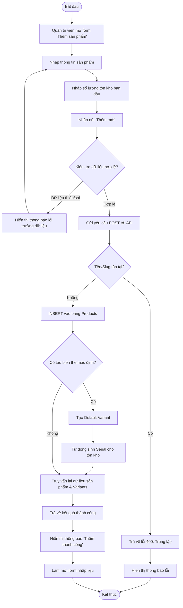

# Activity Diagram: Thêm Mới Sản Phẩm (Add Product)

## Mô tả
Sơ đồ hoạt động này mô tả quy trình nghiệp vụ khi Quản trị viên thực hiện thêm mới một sản phẩm vào hệ thống. Quy trình bao gồm các bước nhập liệu, xác thực, khởi tạo biến thể mặc định (nếu có) và tự động sinh số serial.

