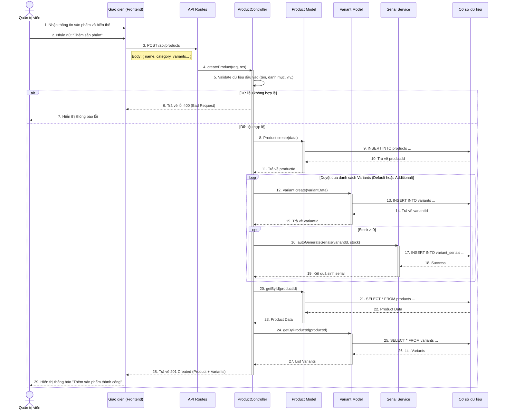

# Sequence Diagram: Thêm Sản Phẩm (Add Product)

## Mô tả
Sơ đồ tuần tự này mô tả quá trình thêm mới một sản phẩm vào hệ thống của Quản trị viên (Admin). Quá trình bao gồm việc tạo thông tin sản phẩm chung, tạo các biến thể (variants), và tự động sinh mã serial (nếu có tồn kho).

