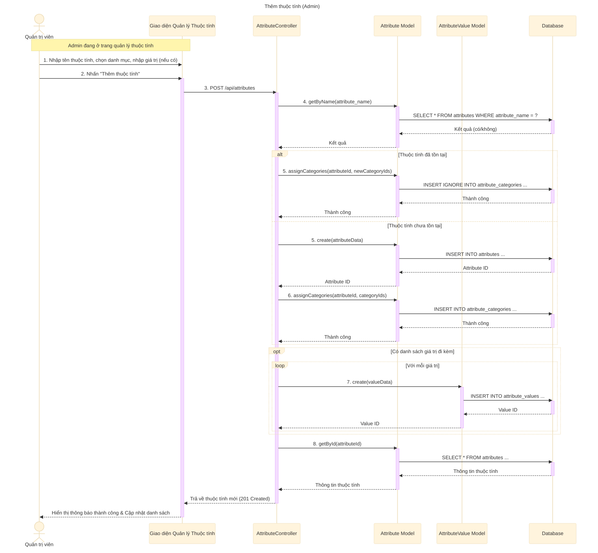

# Sơ đồ tuần tự: Thêm thuộc tính (Admin)

```mermaid
%%{init: {'theme': 'base', 'themeVariables': { 'loopBorder': '#000000'}}}%%
sequenceDiagram
    title: Thêm thuộc tính (Admin)
    actor Admin as Quản trị viên
    participant UI as Giao diện Quản lý Thuộc tính
    participant Controller as AttributeController
    participant Model as Attribute Model
    participant ValueModel as AttributeValue Model
    participant DB as Database

    note over Admin, UI: Admin đang ở trang quản lý thuộc tính

    Admin->>UI: 1. Nhập tên thuộc tính, chọn danh mục, nhập giá trị (nếu có)
    Admin->>UI: 2. Nhấn "Thêm thuộc tính"
    
    activate UI
    UI->>Controller: 3. POST /api/attributes
    activate Controller
    
    Controller->>Model: 4. getByName(attribute_name)
    activate Model
    Model->>DB: SELECT * FROM attributes WHERE attribute_name = ?
    activate DB
    DB-->>Model: Kết quả (có/không)
    deactivate DB
    Model-->>Controller: Kết quả
    deactivate Model
    
    alt Thuộc tính đã tồn tại
        Controller->>Model: 5. assignCategories(attributeId, newCategoryIds)
        activate Model
        Model->>DB: INSERT IGNORE INTO attribute_categories ...
        activate DB
        DB-->>Model: Thành công
        deactivate DB
        Model-->>Controller: Thành công
        deactivate Model
    else Thuộc tính chưa tồn tại
        Controller->>Model: 5. create(attributeData)
        activate Model
        Model->>DB: INSERT INTO attributes ...
        activate DB
        DB-->>Model: Attribute ID
        deactivate DB
        Model-->>Controller: Attribute ID
        deactivate Model
        
        Controller->>Model: 6. assignCategories(attributeId, categoryIds)
        activate Model
        Model->>DB: INSERT INTO attribute_categories ...
        activate DB
        DB-->>Model: Thành công
        deactivate DB
        Model-->>Controller: Thành công
        deactivate Model
    end
    
    opt Có danh sách giá trị đi kèm
        loop Với mỗi giá trị
            Controller->>ValueModel: 7. create(valueData)
            activate ValueModel
            ValueModel->>DB: INSERT INTO attribute_values ...
            activate DB
            DB-->>ValueModel: Value ID
            deactivate DB
            ValueModel-->>Controller: Value ID
            deactivate ValueModel
        end
    end
    
    Controller->>Model: 8. getById(attributeId)
    activate Model
    Model->>DB: SELECT * FROM attributes ...
    activate DB
    DB-->>Model: Thông tin thuộc tính
    deactivate DB
    Model-->>Controller: Thông tin thuộc tính
    deactivate Model
    
    Controller-->>UI: Trả về thuộc tính mới (201 Created)
    deactivate Controller
    
    UI-->>Admin: Hiển thị thông báo thành công & Cập nhật danh sách
    deactivate UI
```