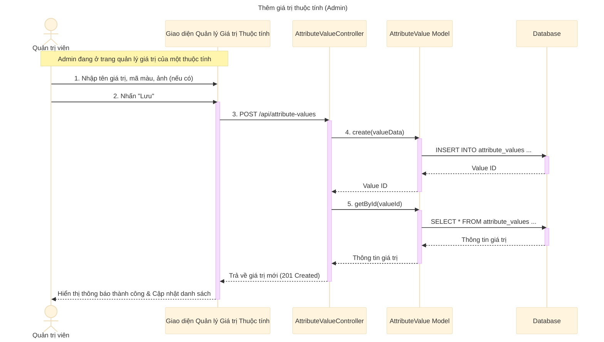

# Sơ đồ tuần tự: Thêm giá trị thuộc tính (Admin)

```mermaid
%%{init: {'theme': 'base', 'themeVariables': { 'loopBorder': '#000000'}}}%%
sequenceDiagram
    title: Thêm giá trị thuộc tính (Admin)
    actor Admin as Quản trị viên
    participant UI as Giao diện Quản lý Giá trị Thuộc tính
    participant Controller as AttributeValueController
    participant Model as AttributeValue Model
    participant DB as Database

    note over Admin, UI: Admin đang ở trang quản lý giá trị của một thuộc tính

    Admin->>UI: 1. Nhập tên giá trị, mã màu, ảnh (nếu có)
    Admin->>UI: 2. Nhấn "Lưu"
    
    activate UI
    UI->>Controller: 3. POST /api/attribute-values
    activate Controller
    
    Controller->>Model: 4. create(valueData)
    activate Model
    Model->>DB: INSERT INTO attribute_values ...
    activate DB
    DB-->>Model: Value ID
    deactivate DB
    Model-->>Controller: Value ID
    deactivate Model
    
    Controller->>Model: 5. getById(valueId)
    activate Model
    Model->>DB: SELECT * FROM attribute_values ...
    activate DB
    DB-->>Model: Thông tin giá trị
    deactivate DB
    Model-->>Controller: Thông tin giá trị
    deactivate Model
    
    Controller-->>UI: Trả về giá trị mới (201 Created)
    deactivate Controller
    
    UI-->>Admin: Hiển thị thông báo thành công & Cập nhật danh sách
    deactivate UI
```