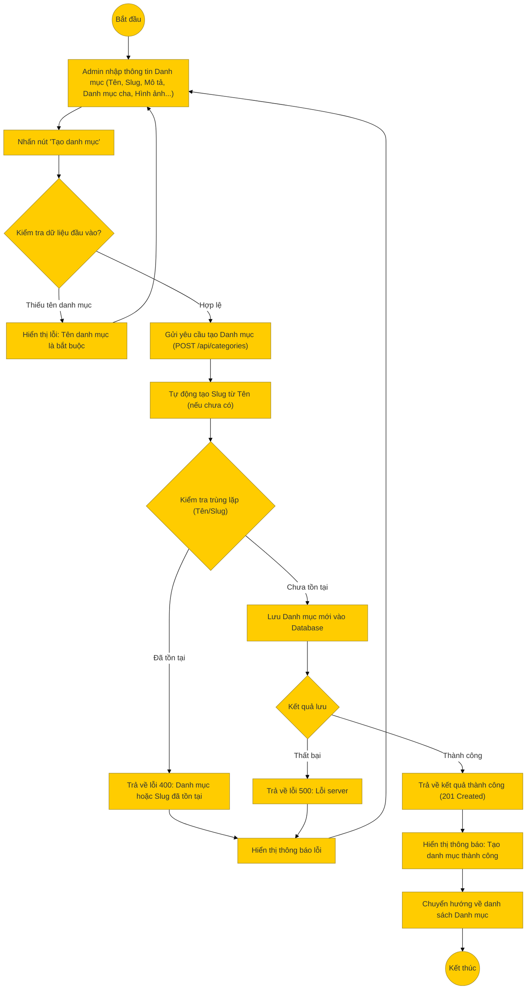

# Sơ đồ hoạt động: Thêm danh mục (Quản trị viên)

## Mô tả chi tiết

1.  **Bắt đầu**: Admin truy cập trang Quản lý danh mục -> Thêm mới.
2.  **Nhập thông tin**: Admin điền các trường:
    *   Tên danh mục (bắt buộc).
    *   Slug (tùy chọn, nếu không nhập sẽ tự sinh từ tên).
    *   Mô tả.
    *   Danh mục cha (nếu là danh mục con).
    *   Hình ảnh (URL hoặc upload).
    *   Thứ tự hiển thị.
3.  **Kiểm tra Frontend**:
    *   Kiểm tra tên danh mục có được nhập không.
4.  **Gửi yêu cầu**: Frontend gọi API `POST /api/categories`.
5.  **Xử lý Backend**:
    *   **Xử lý Slug**: Nếu không có slug, backend tự tạo từ `categoryName`.
    *   **Kiểm tra trùng lặp**: Database sẽ báo lỗi (ER_DUP_ENTRY) nếu tên hoặc slug bị trùng (do ràng buộc Unique).
    *   **Tạo mới**: Lưu bản ghi vào bảng `categories`.
6.  **Thành công**: Trả về thông tin danh mục vừa tạo.
7.  **Kết thúc**: Frontend hiển thị thông báo và quay lại danh sách.
