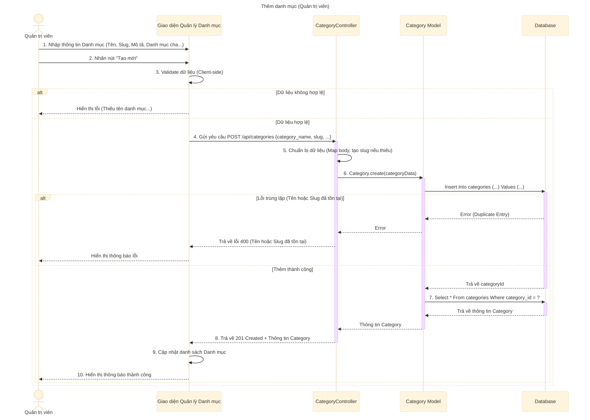

# Sơ đồ tuần tự: Thêm danh mục (Quản trị viên)

## Mô tả chi tiết các bước

1.  **Quản trị viên** nhập thông tin danh mục mới (Tên danh mục, Slug, Mô tả, Danh mục cha, Hình ảnh, Trạng thái, Thứ tự hiển thị).
2.  **Giao diện** kiểm tra sơ bộ (validate) dữ liệu (ví dụ: Tên danh mục là bắt buộc).
3.  Nếu dữ liệu hợp lệ, **Giao diện** gửi request `POST` đến API `createCategory`.
4.  **CategoryController** nhận request, ánh xạ dữ liệu từ request body sang cấu trúc của Model.
5.  Nếu `slug` không được cung cấp, Controller sẽ tự động tạo slug từ tên danh mục.
6.  **CategoryController** gọi **Category Model** để tạo danh mục mới trong Database.
7.  **Category Model** thực hiện câu lệnh `INSERT`.
    *   Nếu xảy ra lỗi trùng lặp (Duplicate Entry) do tên hoặc slug đã tồn tại, Database trả về lỗi. Controller bắt lỗi này và trả về mã lỗi 400 cho Client.
    *   Nếu thêm thành công, Database trả về ID của danh mục vừa tạo.
8.  **Category Model** tiếp tục truy vấn Database để lấy thông tin chi tiết của danh mục vừa tạo.
9.  **CategoryController** trả về phản hồi thành công (201 Created) kèm thông tin danh mục.
10. **Giao diện** cập nhật danh sách danh mục và hiển thị thông báo thành công cho Quản trị viên.
