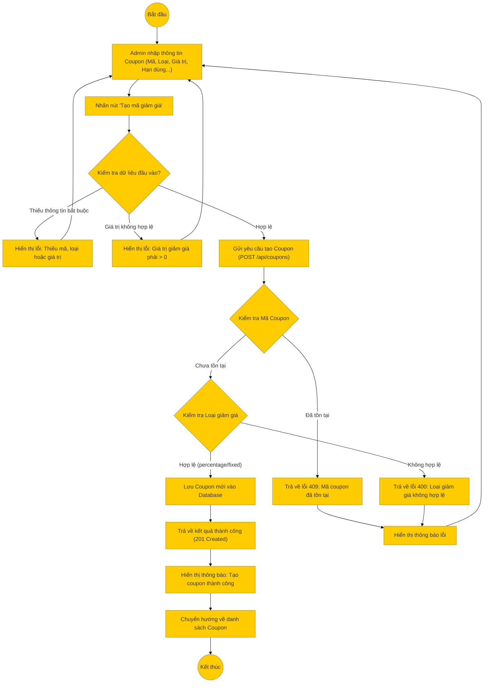

# Sơ đồ hoạt động: Thêm mã giảm giá (Quản trị viên)

## Mô tả chi tiết

1.  **Bắt đầu**: Admin truy cập trang Quản lý mã giảm giá -> Thêm mới.
2.  **Nhập thông tin**: Admin điền các trường:
    *   Mã Coupon (bắt buộc, duy nhất).
    *   Loại giảm giá (`percentage` hoặc `fixed_amount`).
    *   Giá trị giảm.
    *   Các điều kiện khác: Đơn tối thiểu, Giảm tối đa, Giới hạn lượt dùng, Thời gian hiệu lực.
3.  **Kiểm tra Frontend**:
    *   Kiểm tra các trường bắt buộc.
    *   Kiểm tra tính hợp lệ của số liệu (Giá trị > 0).
4.  **Gửi yêu cầu**: Frontend gọi API `POST /api/coupons`.
5.  **Xử lý Backend**:
    *   **Kiểm tra trùng lặp**: Tìm trong DB xem mã coupon đã tồn tại chưa. Nếu có, trả về lỗi 409.
    *   **Validate dữ liệu**: Kiểm tra loại giảm giá và giá trị số.
    *   **Tạo mới**: Lưu bản ghi vào bảng `coupons`.
6.  **Thành công**: Trả về thông tin coupon vừa tạo.
7.  **Kết thúc**: Frontend hiển thị thông báo và quay lại danh sách.
