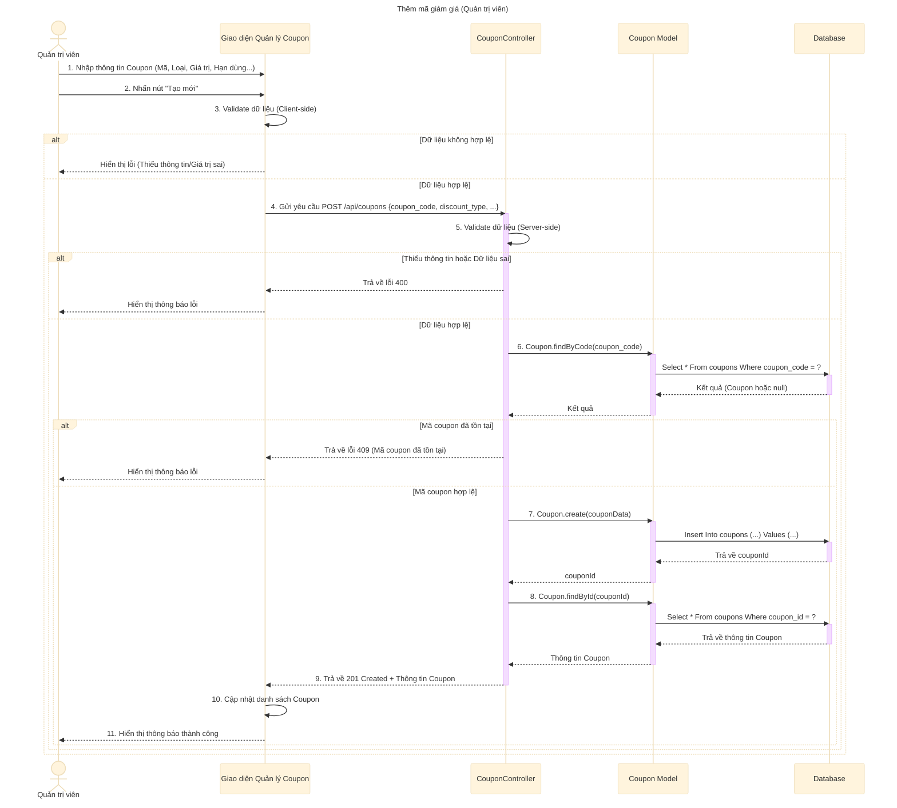

# Sơ đồ tuần tự: Thêm mã giảm giá (Quản trị viên)

## Mô tả chi tiết các bước

1.  **Quản trị viên** nhập thông tin mã giảm giá mới (Mã, Mô tả, Loại giảm giá, Giá trị, Điều kiện...).
2.  **Giao diện** kiểm tra sơ bộ (validate) dữ liệu.
3.  Nếu dữ liệu hợp lệ, **Giao diện** gửi request `POST` đến API `createCoupon`.
4.  **CouponController** nhận request và kiểm tra dữ liệu đầu vào (Server-side validation).
5.  **CouponController** gọi **Coupon Model** để kiểm tra xem `coupon_code` đã tồn tại chưa.
6.  Nếu mã đã tồn tại, trả về lỗi 409.
7.  Nếu mã chưa tồn tại, gọi **Coupon Model** để tạo coupon mới trong Database.
8.  Sau khi tạo thành công, gọi **Coupon Model** để lấy thông tin chi tiết của coupon vừa tạo.
9.  **CouponController** trả về phản hồi thành công (201 Created) kèm thông tin coupon.
10. **Giao diện** cập nhật danh sách và hiển thị thông báo thành công.
