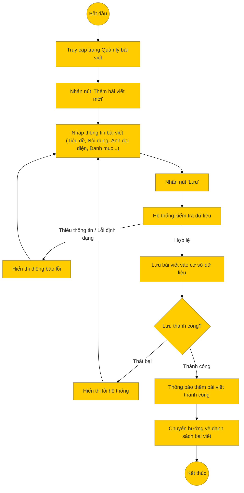

```mermaid
%%{init: {'theme': 'base', 'themeVariables': { 'primaryColor': '#ffcc00', 'edgeLabelBackground':'#ffffff', 'tertiaryColor': '#fff0f0'}}}%%
flowchart TD
    Start((Bắt đầu)) --> AccessPage["Truy cập trang Quản lý bài viết"]
    AccessPage --> ClickAdd["Nhấn nút 'Thêm bài viết mới'"]
    ClickAdd --> FillForm["Nhập thông tin bài viết (Tiêu đề, Nội dung, Ảnh đại diện, Danh mục...)"]
    
    FillForm --> ClickSave["Nhấn nút 'Lưu'"]
    ClickSave --> Validate["Hệ thống kiểm tra dữ liệu"]
    
    Validate -- "Thiếu thông tin / Lỗi định dạng" --> ShowError["Hiển thị thông báo lỗi"]
    ShowError --> FillForm
    
    Validate -- "Hợp lệ" --> SaveDB["Lưu bài viết vào cơ sở dữ liệu"]
    SaveDB --> CheckResult{"Lưu thành công?"}
    
    CheckResult -- "Thất bại" --> ShowDBError["Hiển thị lỗi hệ thống"]
    ShowDBError --> FillForm
    
    CheckResult -- "Thành công" --> NotifySuccess["Thông báo thêm bài viết thành công"]
    NotifySuccess --> Redirect["Chuyển hướng về danh sách bài viết"]
    Redirect --> End((Kết thúc))
```