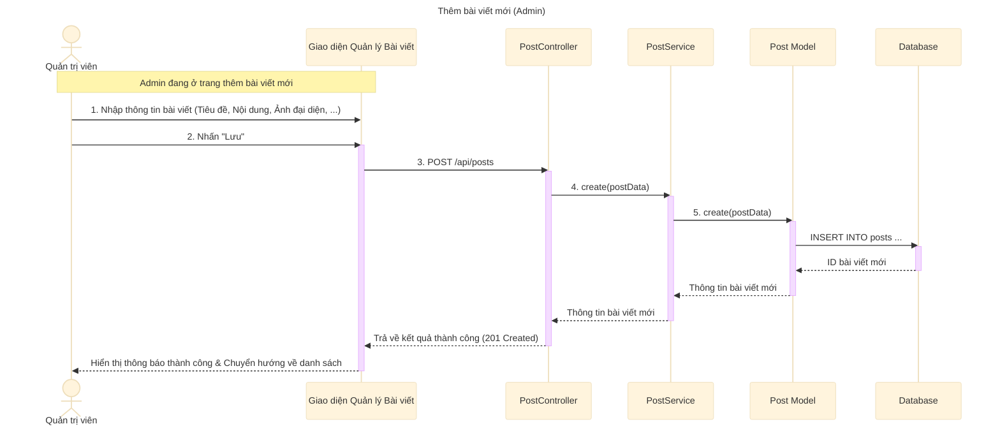

# Sơ đồ tuần tự: Thêm bài viết mới (Admin)

```mermaid
%%{init: {'theme': 'base', 'themeVariables': { 'loopBorder': '#000000'}}}%%
sequenceDiagram
    title: Thêm bài viết mới (Admin)
    actor Admin as Quản trị viên
    participant UI as Giao diện Quản lý Bài viết
    participant Controller as PostController
    participant Service as PostService
    participant Model as Post Model
    participant DB as Database

    note over Admin, UI: Admin đang ở trang thêm bài viết mới

    Admin->>UI: 1. Nhập thông tin bài viết (Tiêu đề, Nội dung, Ảnh đại diện, ...)
    Admin->>UI: 2. Nhấn "Lưu"
    
    activate UI
    UI->>Controller: 3. POST /api/posts
    activate Controller
    
    Controller->>Service: 4. create(postData)
    activate Service
    Service->>Model: 5. create(postData)
    activate Model
    Model->>DB: INSERT INTO posts ...
    activate DB
    DB-->>Model: ID bài viết mới
    deactivate DB
    Model-->>Service: Thông tin bài viết mới
    deactivate Model
    Service-->>Controller: Thông tin bài viết mới
    deactivate Service
    
    Controller-->>UI: Trả về kết quả thành công (201 Created)
    deactivate Controller
    
    UI-->>Admin: Hiển thị thông báo thành công & Chuyển hướng về danh sách
    deactivate UI
```