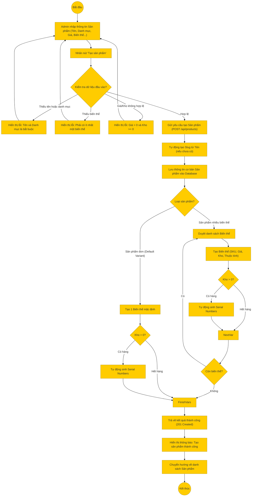

# Sơ đồ hoạt động: Thêm sản phẩm (Quản trị viên)

## Mô tả chi tiết

1.  **Bắt đầu**: Admin truy cập trang Quản lý sản phẩm -> Thêm mới.
2.  **Nhập thông tin**: Admin điền các trường:
    *   Thông tin chung: Tên, Danh mục, Mô tả.
    *   Biến thể:
        *   Nếu không có thuộc tính (Màu, Size...): Nhập giá và kho cho biến thể mặc định.
        *   Nếu có thuộc tính: Nhập danh sách biến thể (SKU, Giá, Kho, Thuộc tính tương ứng).
3.  **Kiểm tra Frontend**:
    *   Bắt buộc phải có Tên và Danh mục.
    *   Phải có ít nhất 1 biến thể (hoặc default hoặc list variants).
    *   Giá phải dương, tồn kho không âm.
4.  **Gửi yêu cầu**: Frontend gọi API `POST /api/products`.
5.  **Xử lý Backend**:
    *   **Tạo Slug**: Tự động tạo từ tên nếu chưa có.
    *   **Lưu Product**: Tạo bản ghi trong bảng `products`.
    *   **Xử lý Biến thể**:
        *   Nếu là sản phẩm đơn: Tạo 1 dòng trong bảng `variants` (isDefault=1).
        *   Nếu là sản phẩm nhiều biến thể: Lặp qua danh sách `additionalVariants` và tạo các dòng trong bảng `variants`, liên kết với `attribute_values`.
    *   **Sinh Serial**: Nếu biến thể có số lượng tồn kho > 0, hệ thống tự động sinh các mã Serial (Serial Number) tương ứng để quản lý bảo hành/kho chi tiết.
6.  **Thành công**: Trả về thông tin sản phẩm vừa tạo.
7.  **Kết thúc**: Frontend hiển thị thông báo và quay lại danh sách.
