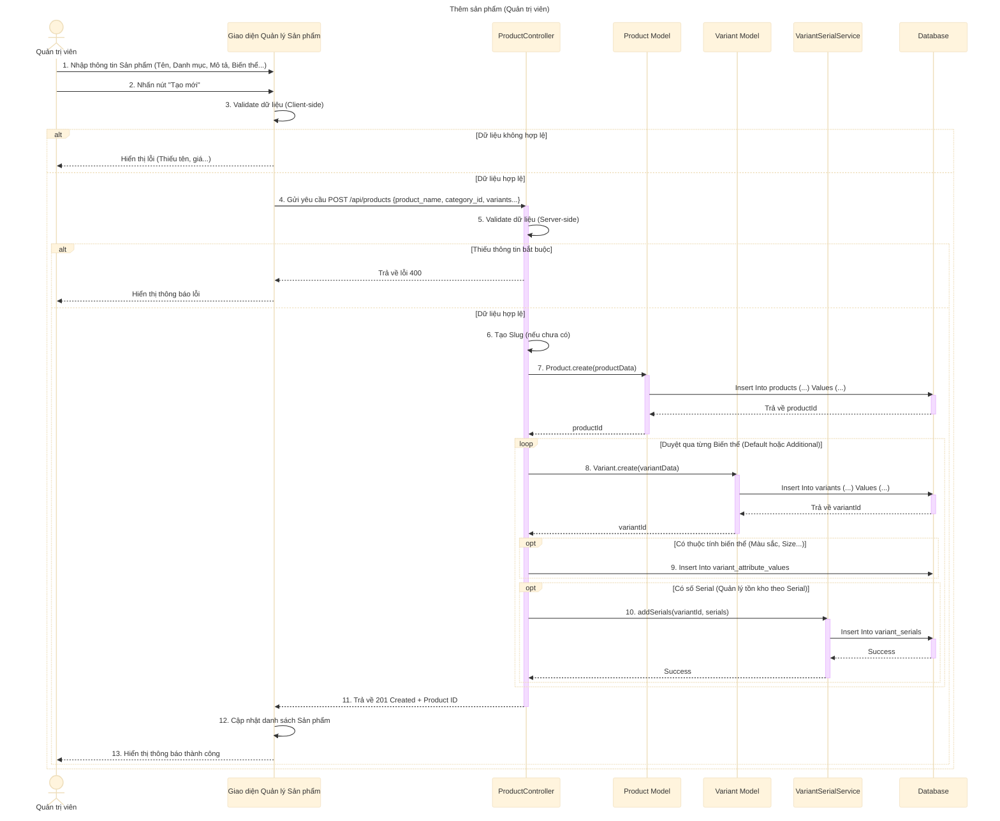

# Sơ đồ tuần tự: Thêm sản phẩm (Quản trị viên)

## Mô tả chi tiết các bước

1.  **Quản trị viên** nhập thông tin sản phẩm mới (Tên, Danh mục, Mô tả, Giá, Hình ảnh, các Biến thể...).
2.  **Giao diện** kiểm tra sơ bộ (validate) dữ liệu.
3.  Nếu dữ liệu hợp lệ, **Giao diện** gửi request `POST` đến API `createProduct`.
4.  **ProductController** nhận request và kiểm tra dữ liệu đầu vào (Tên, Danh mục, Biến thể bắt buộc...).
5.  Nếu thiếu thông tin, trả về lỗi 400.
6.  Nếu hợp lệ, tạo Slug từ tên sản phẩm (nếu chưa có).
7.  **ProductController** gọi **Product Model** để tạo sản phẩm chung trong bảng `products`.
8.  Sau khi có `productId`, **ProductController** duyệt qua danh sách các biến thể (Variants) được gửi lên.
    *   Gọi **Variant Model** để tạo từng biến thể trong bảng `variants`.
    *   Nếu biến thể có thuộc tính (ví dụ: Màu đỏ, Size L), lưu thông tin vào bảng `variant_attribute_values`.
    *   Nếu biến thể có danh sách số Serial (để quản lý bảo hành/tồn kho), gọi **VariantSerialService** để lưu vào bảng `variant_serials`.
9.  Sau khi xử lý xong tất cả, **ProductController** trả về phản hồi thành công (201 Created).
10. **Giao diện** cập nhật danh sách và hiển thị thông báo thành công.
