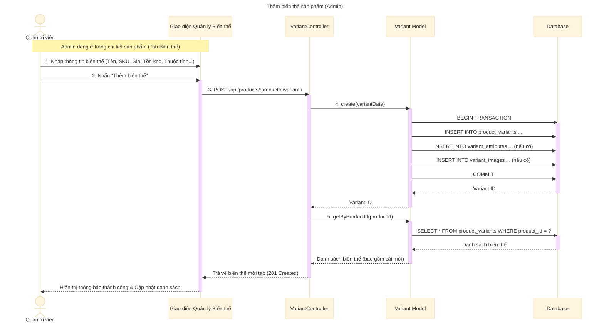

# Sơ đồ tuần tự: Thêm biến thể sản phẩm (Admin)

```mermaid
%%{init: {'theme': 'base', 'themeVariables': { 'loopBorder': '#000000'}}}%%
sequenceDiagram
    title: Thêm biến thể sản phẩm (Admin)
    actor Admin as Quản trị viên
    participant UI as Giao diện Quản lý Biến thể
    participant Controller as VariantController
    participant Model as Variant Model
    participant DB as Database

    note over Admin, UI: Admin đang ở trang chi tiết sản phẩm (Tab Biến thể)

    Admin->>UI: 1. Nhập thông tin biến thể (Tên, SKU, Giá, Tồn kho, Thuộc tính...)
    Admin->>UI: 2. Nhấn "Thêm biến thể"
    
    activate UI
    UI->>Controller: 3. POST /api/products/:productId/variants
    activate Controller
    
    Controller->>Model: 4. create(variantData)
    activate Model
    
    Model->>DB: BEGIN TRANSACTION
    activate DB
    Model->>DB: INSERT INTO product_variants ...
    Model->>DB: INSERT INTO variant_attributes ... (nếu có)
    Model->>DB: INSERT INTO variant_images ... (nếu có)
    Model->>DB: COMMIT
    DB-->>Model: Variant ID
    deactivate DB
    
    Model-->>Controller: Variant ID
    deactivate Model
    
    Controller->>Model: 5. getByProductId(productId)
    activate Model
    Model->>DB: SELECT * FROM product_variants WHERE product_id = ?
    activate DB
    DB-->>Model: Danh sách biến thể
    deactivate DB
    Model-->>Controller: Danh sách biến thể (bao gồm cái mới)
    deactivate Model
    
    Controller-->>UI: Trả về biến thể mới tạo (201 Created)
    deactivate Controller
    
    UI-->>Admin: Hiển thị thông báo thành công & Cập nhật danh sách
    deactivate UI
```