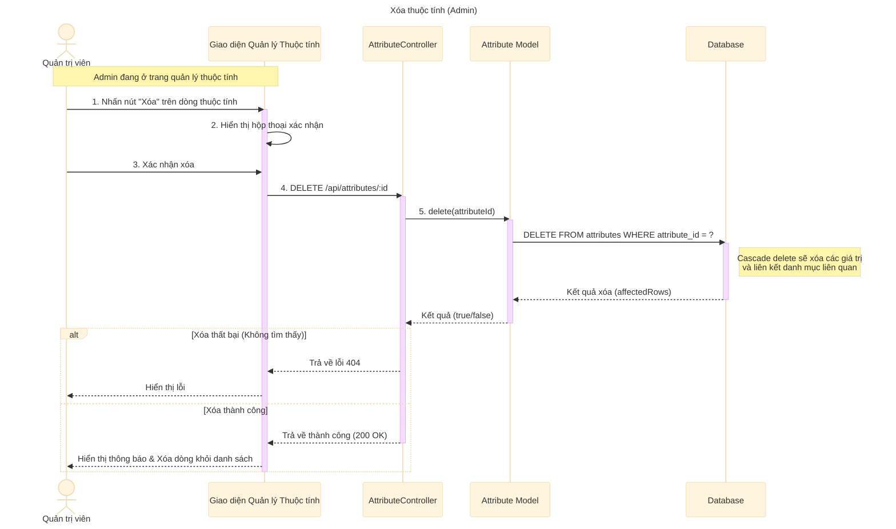

# Sơ đồ tuần tự: Xóa thuộc tính (Admin)

```mermaid
%%{init: {'theme': 'base', 'themeVariables': { 'loopBorder': '#000000'}}}%%
sequenceDiagram
    title: Xóa thuộc tính (Admin)
    actor Admin as Quản trị viên
    participant UI as Giao diện Quản lý Thuộc tính
    participant Controller as AttributeController
    participant Model as Attribute Model
    participant DB as Database

    note over Admin, UI: Admin đang ở trang quản lý thuộc tính

    Admin->>UI: 1. Nhấn nút "Xóa" trên dòng thuộc tính
    activate UI
    UI->>UI: 2. Hiển thị hộp thoại xác nhận
    Admin->>UI: 3. Xác nhận xóa
    
    UI->>Controller: 4. DELETE /api/attributes/:id
    activate Controller
    
    Controller->>Model: 5. delete(attributeId)
    activate Model
    
    Model->>DB: DELETE FROM attributes WHERE attribute_id = ?
    activate DB
    note right of DB: Cascade delete sẽ xóa các giá trị<br/>và liên kết danh mục liên quan
    DB-->>Model: Kết quả xóa (affectedRows)
    deactivate DB
    
    Model-->>Controller: Kết quả (true/false)
    deactivate Model
    
    alt Xóa thất bại (Không tìm thấy)
        Controller-->>UI: Trả về lỗi 404
        UI-->>Admin: Hiển thị lỗi
    else Xóa thành công
        Controller-->>UI: Trả về thành công (200 OK)
        deactivate Controller
        
        UI-->>Admin: Hiển thị thông báo & Xóa dòng khỏi danh sách
    end
    deactivate UI
```