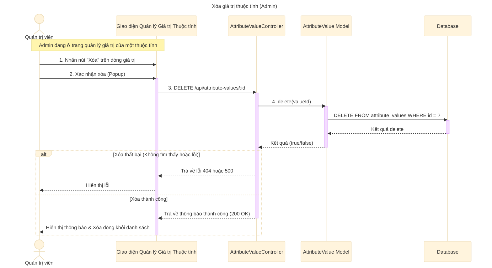

# Sơ đồ tuần tự: Xóa giá trị thuộc tính (Admin)

```mermaid
%%{init: {'theme': 'base', 'themeVariables': { 'loopBorder': '#000000'}}}%%
sequenceDiagram
    title: Xóa giá trị thuộc tính (Admin)
    actor Admin as Quản trị viên
    participant UI as Giao diện Quản lý Giá trị Thuộc tính
    participant Controller as AttributeValueController
    participant Model as AttributeValue Model
    participant DB as Database

    note over Admin, UI: Admin đang ở trang quản lý giá trị của một thuộc tính

    Admin->>UI: 1. Nhấn nút "Xóa" trên dòng giá trị
    Admin->>UI: 2. Xác nhận xóa (Popup)
    
    activate UI
    UI->>Controller: 3. DELETE /api/attribute-values/:id
    activate Controller
    
    Controller->>Model: 4. delete(valueId)
    activate Model
    Model->>DB: DELETE FROM attribute_values WHERE id = ?
    activate DB
    DB-->>Model: Kết quả delete
    deactivate DB
    Model-->>Controller: Kết quả (true/false)
    deactivate Model
    
    alt Xóa thất bại (Không tìm thấy hoặc lỗi)
        Controller-->>UI: Trả về lỗi 404 hoặc 500
        UI-->>Admin: Hiển thị lỗi
    else Xóa thành công
        Controller-->>UI: Trả về thông báo thành công (200 OK)
        deactivate Controller
        
        UI-->>Admin: Hiển thị thông báo & Xóa dòng khỏi danh sách
    end
    deactivate UI
```