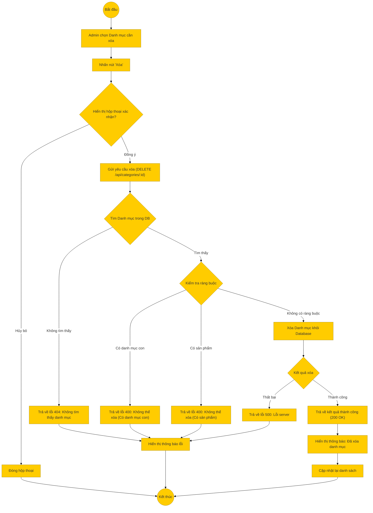

# Sơ đồ hoạt động: Xóa danh mục (Quản trị viên)

## Mô tả chi tiết

1.  **Bắt đầu**: Admin chọn một danh mục từ danh sách để xóa.
2.  **Xác nhận**: Hệ thống yêu cầu xác nhận hành động xóa.
3.  **Gửi yêu cầu**: Nếu đồng ý, Frontend gọi API `DELETE /api/categories/:id`.
4.  **Xử lý Backend**:
    *   **Kiểm tra tồn tại**: Nếu ID không đúng -> 404.
    *   **Kiểm tra ràng buộc**:
        *   Nếu danh mục có danh mục con đang hoạt động -> Trả về lỗi 400.
        *   Nếu danh mục có sản phẩm đang hoạt động -> Trả về lỗi 400.
    *   **Xóa**: Nếu không vi phạm ràng buộc, thực hiện xóa khỏi DB.
5.  **Thành công**: Trả về thông báo thành công.
6.  **Kết thúc**: Frontend cập nhật lại giao diện.
