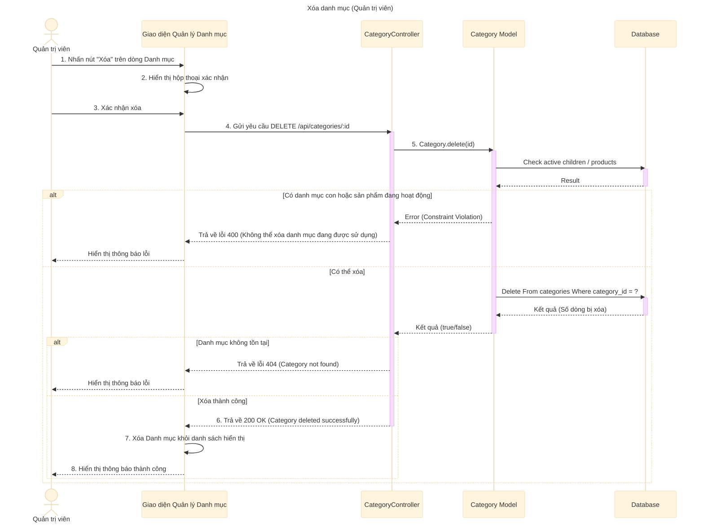

# Sơ đồ tuần tự: Xóa danh mục (Quản trị viên)

## Mô tả chi tiết các bước

1.  **Quản trị viên** nhấn nút "Xóa" tương ứng với một danh mục trong danh sách.
2.  **Giao diện** hiển thị hộp thoại xác nhận hành động xóa.
3.  **Quản trị viên** xác nhận muốn xóa.
4.  **Giao diện** gửi request `DELETE` đến API `deleteCategory` với ID của danh mục.
5.  **CategoryController** gọi **Category Model** để thực hiện xóa.
6.  **Category Model** kiểm tra các ràng buộc trước khi xóa:
    *   Kiểm tra xem danh mục có danh mục con đang hoạt động hay không.
    *   Kiểm tra xem danh mục có sản phẩm đang hoạt động hay không.
7.  Nếu vi phạm ràng buộc (có con hoặc có sản phẩm), **Category Model** trả về lỗi. **CategoryController** bắt lỗi và trả về mã lỗi 400 cho Client.
8.  Nếu không vi phạm, **Category Model** thực hiện xóa trong Database và trả về kết quả.
9.  Nếu xóa thành công, **CategoryController** trả về phản hồi thành công (200 OK).
10. **Giao diện** cập nhật lại danh sách (loại bỏ danh mục vừa xóa) và hiển thị thông báo thành công.
