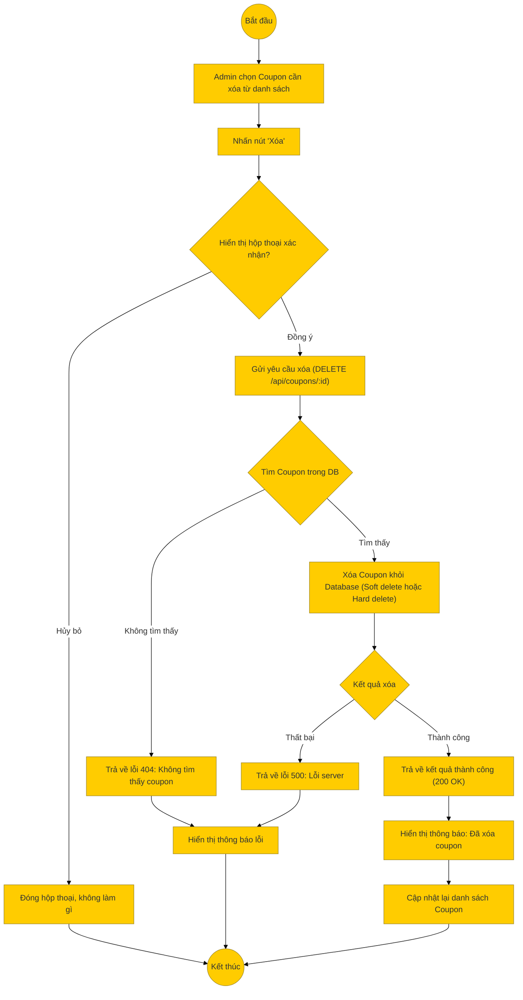

# Sơ đồ hoạt động: Xóa mã giảm giá (Quản trị viên)

## Mô tả chi tiết

1.  **Bắt đầu**: Admin xem danh sách mã giảm giá và chọn một mã để xóa.
2.  **Xác nhận**: Hệ thống hiển thị hộp thoại xác nhận (Confirm Dialog) để tránh xóa nhầm.
3.  **Gửi yêu cầu**: Nếu Admin đồng ý, Frontend gọi API `DELETE /api/coupons/:couponId`.
4.  **Xử lý Backend**:
    *   Backend nhận ID và tìm bản ghi trong Database.
    *   Nếu không tìm thấy, trả về lỗi 404.
    *   Nếu tìm thấy, thực hiện xóa (có thể là xóa vĩnh viễn hoặc đánh dấu `deleted_at` tùy cấu hình DB, trong code hiện tại là hàm `delete`).
5.  **Thành công**: Trả về thông báo thành công.
6.  **Kết thúc**: Frontend xóa dòng tương ứng khỏi bảng hiển thị hoặc tải lại danh sách.
