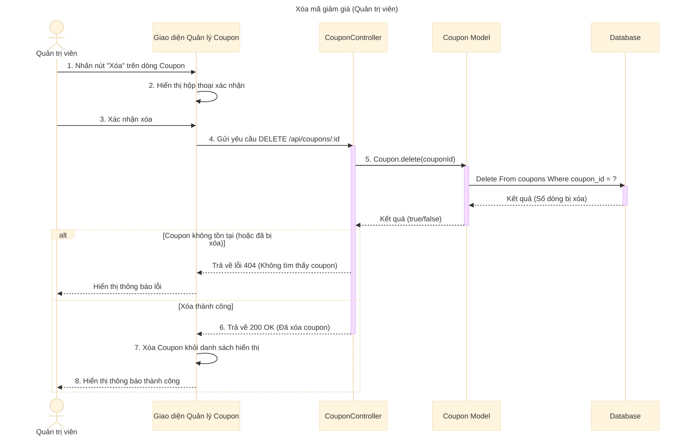

# Sơ đồ tuần tự: Xóa mã giảm giá (Quản trị viên)

## Mô tả chi tiết các bước

1.  **Quản trị viên** nhấn nút "Xóa" tương ứng với một mã giảm giá trong danh sách.
2.  **Giao diện** hiển thị hộp thoại xác nhận hành động xóa.
3.  **Quản trị viên** xác nhận muốn xóa.
4.  **Giao diện** gửi request `DELETE` đến API `deleteCoupon` với ID của coupon.
5.  **CouponController** gọi **Coupon Model** để thực hiện xóa coupon trong Database.
6.  **Coupon Model** thực hiện câu lệnh `DELETE` và trả về kết quả.
    *   Nếu không tìm thấy dòng nào bị xóa (hoặc lỗi), trả về `false`.
    *   Nếu xóa thành công, trả về `true`.
7.  Nếu kết quả là `false`, **CouponController** trả về lỗi 404.
8.  Nếu kết quả là `true`, **CouponController** trả về phản hồi thành công (200 OK).
9.  **Giao diện** cập nhật lại danh sách (loại bỏ coupon vừa xóa) và hiển thị thông báo thành công.
