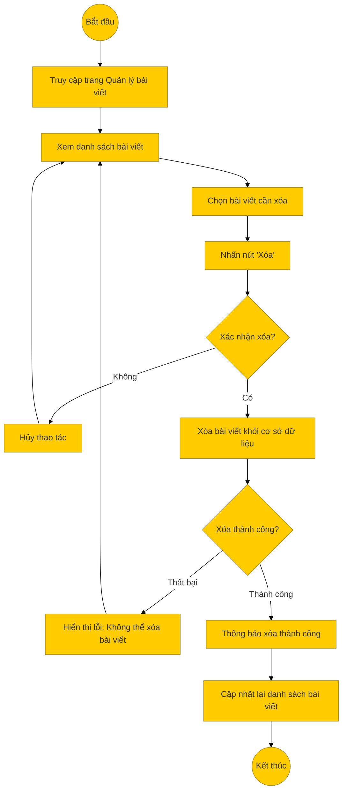

```mermaid
%%{init: {'theme': 'base', 'themeVariables': { 'primaryColor': '#ffcc00', 'edgeLabelBackground':'#ffffff', 'tertiaryColor': '#fff0f0'}}}%%
flowchart TD
    Start((Bắt đầu)) --> AccessPage["Truy cập trang Quản lý bài viết"]
    AccessPage --> ViewList["Xem danh sách bài viết"]
    ViewList --> SelectPost["Chọn bài viết cần xóa"]
    
    SelectPost --> ClickDelete["Nhấn nút 'Xóa'"]
    ClickDelete --> Confirm{"Xác nhận xóa?"}
    
    Confirm -- "Không" --> Cancel["Hủy thao tác"]
    Cancel --> ViewList
    
    Confirm -- "Có" --> DeleteDB["Xóa bài viết khỏi cơ sở dữ liệu"]
    DeleteDB --> CheckResult{"Xóa thành công?"}
    
    CheckResult -- "Thất bại" --> ShowError["Hiển thị lỗi: Không thể xóa bài viết"]
    ShowError --> ViewList
    
    CheckResult -- "Thành công" --> NotifySuccess["Thông báo xóa thành công"]
    NotifySuccess --> RefreshList["Cập nhật lại danh sách bài viết"]
    RefreshList --> End((Kết thúc))
```