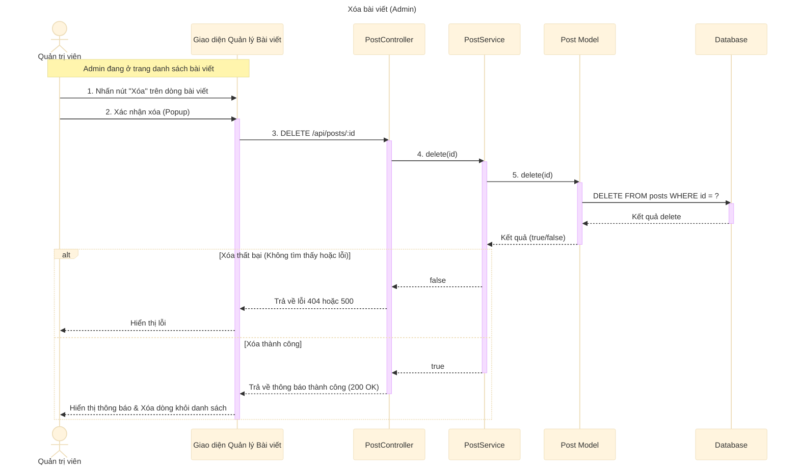

# Sơ đồ tuần tự: Xóa bài viết (Admin)

```mermaid
%%{init: {'theme': 'base', 'themeVariables': { 'loopBorder': '#000000'}}}%%
sequenceDiagram
    title: Xóa bài viết (Admin)
    actor Admin as Quản trị viên
    participant UI as Giao diện Quản lý Bài viết
    participant Controller as PostController
    participant Service as PostService
    participant Model as Post Model
    participant DB as Database

    note over Admin, UI: Admin đang ở trang danh sách bài viết

    Admin->>UI: 1. Nhấn nút "Xóa" trên dòng bài viết
    Admin->>UI: 2. Xác nhận xóa (Popup)
    
    activate UI
    UI->>Controller: 3. DELETE /api/posts/:id
    activate Controller
    
    Controller->>Service: 4. delete(id)
    activate Service
    Service->>Model: 5. delete(id)
    activate Model
    Model->>DB: DELETE FROM posts WHERE id = ?
    activate DB
    DB-->>Model: Kết quả delete
    deactivate DB
    Model-->>Service: Kết quả (true/false)
    deactivate Model
    
    alt Xóa thất bại (Không tìm thấy hoặc lỗi)
        Service-->>Controller: false
        Controller-->>UI: Trả về lỗi 404 hoặc 500
        UI-->>Admin: Hiển thị lỗi
    else Xóa thành công
        Service-->>Controller: true
        deactivate Service
        Controller-->>UI: Trả về thông báo thành công (200 OK)
        deactivate Controller
        
        UI-->>Admin: Hiển thị thông báo & Xóa dòng khỏi danh sách
    end
    deactivate UI
```