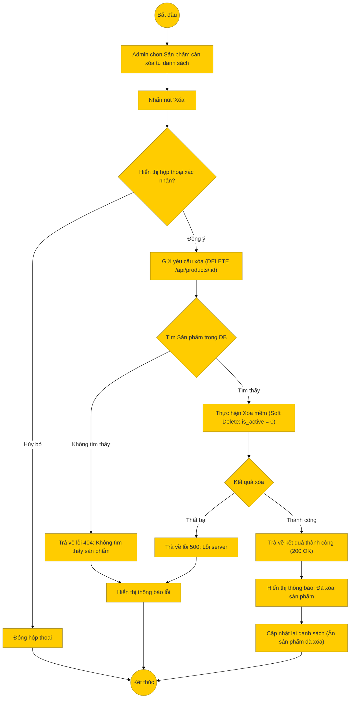

# Sơ đồ hoạt động: Xóa sản phẩm (Quản trị viên)

## Mô tả chi tiết

1.  **Bắt đầu**: Admin tìm và chọn sản phẩm cần xóa trong danh sách quản lý.
2.  **Xác nhận**: Hệ thống hiển thị cảnh báo xác nhận để tránh thao tác nhầm.
3.  **Gửi yêu cầu**: Nếu Admin xác nhận, Frontend gọi API `DELETE /api/products/:id`.
4.  **Xử lý Backend**:
    *   **Kiểm tra tồn tại**: Tìm sản phẩm theo ID. Nếu không thấy -> 404.
    *   **Xóa mềm (Soft Delete)**: Thay vì xóa vĩnh viễn khỏi Database, hệ thống cập nhật trạng thái `is_active = 0`. Điều này giúp giữ lại lịch sử đơn hàng và dữ liệu liên quan.
5.  **Thành công**: Trả về thông báo thành công.
6.  **Kết thúc**: Frontend loại bỏ sản phẩm khỏi danh sách hiển thị (hoặc chuyển sang tab "Đã xóa").
