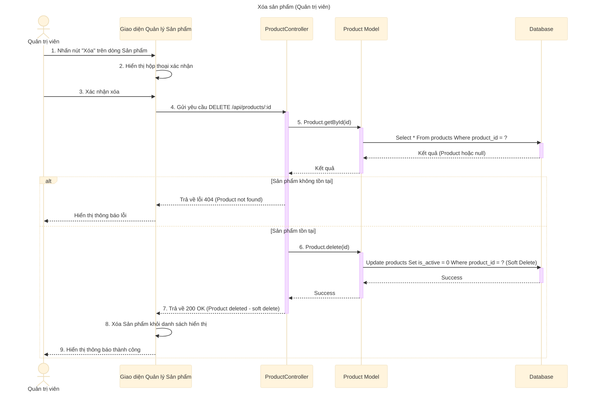

# Sơ đồ tuần tự: Xóa sản phẩm (Quản trị viên)

## Mô tả chi tiết các bước

1.  **Quản trị viên** nhấn nút "Xóa" tương ứng với một sản phẩm trong danh sách.
2.  **Giao diện** hiển thị hộp thoại xác nhận hành động xóa.
3.  **Quản trị viên** xác nhận muốn xóa.
4.  **Giao diện** gửi request `DELETE` đến API `deleteProduct` với ID của sản phẩm.
5.  **ProductController** gọi **Product Model** để kiểm tra xem sản phẩm có tồn tại không.
6.  Nếu không tìm thấy sản phẩm, trả về lỗi 404.
7.  Nếu tìm thấy, **ProductController** gọi **Product Model** để thực hiện xóa.
    *   Lưu ý: Đây là **Soft Delete** (Xóa mềm), tức là cập nhật trạng thái `is_active = 0` hoặc `deleted_at = NOW()` chứ không xóa hẳn khỏi Database để giữ lại lịch sử đơn hàng.
8.  Sau khi xóa thành công, **ProductController** trả về phản hồi thành công (200 OK).
9.  **Giao diện** cập nhật lại danh sách (loại bỏ sản phẩm vừa xóa) và hiển thị thông báo thành công.
