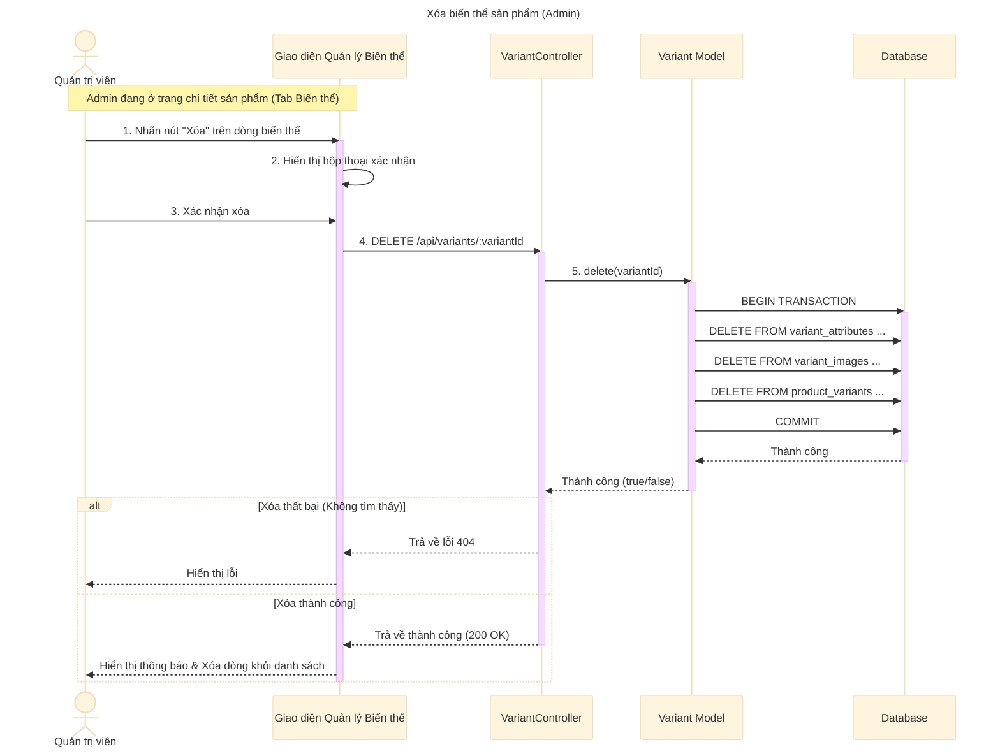

# Sơ đồ tuần tự: Xóa biến thể sản phẩm (Admin)

```mermaid
%%{init: {'theme': 'base', 'themeVariables': { 'loopBorder': '#000000'}}}%%
sequenceDiagram
    title: Xóa biến thể sản phẩm (Admin)
    actor Admin as Quản trị viên
    participant UI as Giao diện Quản lý Biến thể
    participant Controller as VariantController
    participant Model as Variant Model
    participant DB as Database

    note over Admin, UI: Admin đang ở trang chi tiết sản phẩm (Tab Biến thể)

    Admin->>UI: 1. Nhấn nút "Xóa" trên dòng biến thể
    activate UI
    UI->>UI: 2. Hiển thị hộp thoại xác nhận
    Admin->>UI: 3. Xác nhận xóa
    
    UI->>Controller: 4. DELETE /api/variants/:variantId
    activate Controller
    
    Controller->>Model: 5. delete(variantId)
    activate Model
    
    Model->>DB: BEGIN TRANSACTION
    activate DB
    Model->>DB: DELETE FROM variant_attributes ...
    Model->>DB: DELETE FROM variant_images ...
    Model->>DB: DELETE FROM product_variants ...
    Model->>DB: COMMIT
    DB-->>Model: Thành công
    deactivate DB
    
    Model-->>Controller: Thành công (true/false)
    deactivate Model
    
    alt Xóa thất bại (Không tìm thấy)
        Controller-->>UI: Trả về lỗi 404
        UI-->>Admin: Hiển thị lỗi
    else Xóa thành công
        Controller-->>UI: Trả về thành công (200 OK)
        deactivate Controller
        
        UI-->>Admin: Hiển thị thông báo & Xóa dòng khỏi danh sách
    end
    deactivate UI
```