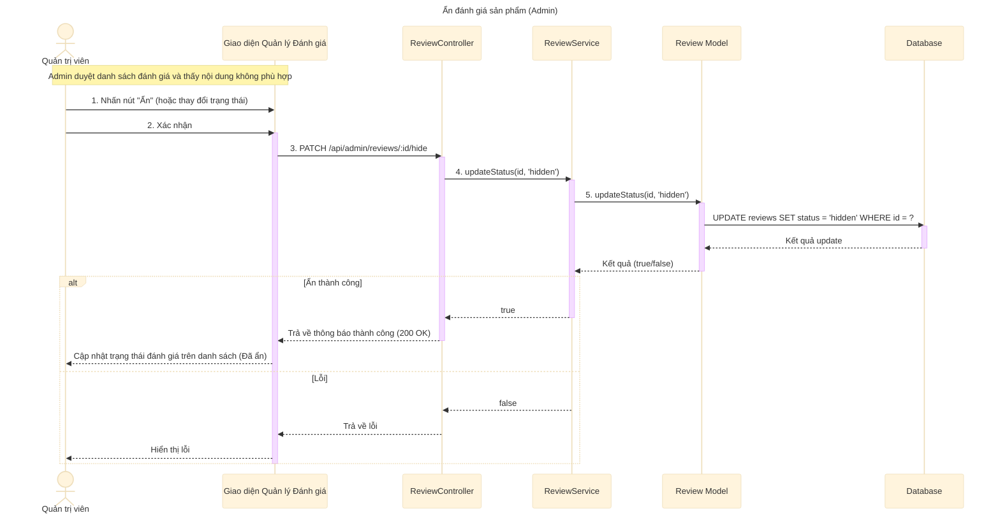

# Sơ đồ tuần tự: Ẩn đánh giá sản phẩm (Admin)

```mermaid
%%{init: {'theme': 'base', 'themeVariables': { 'loopBorder': '#000000'}}}%%
sequenceDiagram
    title: Ẩn đánh giá sản phẩm (Admin)
    actor Admin as Quản trị viên
    participant UI as Giao diện Quản lý Đánh giá
    participant Controller as ReviewController
    participant Service as ReviewService
    participant Model as Review Model
    participant DB as Database

    note over Admin, UI: Admin duyệt danh sách đánh giá và thấy nội dung không phù hợp

    Admin->>UI: 1. Nhấn nút "Ẩn" (hoặc thay đổi trạng thái)
    Admin->>UI: 2. Xác nhận
    
    activate UI
    UI->>Controller: 3. PATCH /api/admin/reviews/:id/hide
    activate Controller
    
    Controller->>Service: 4. updateStatus(id, 'hidden')
    activate Service
    
    Service->>Model: 5. updateStatus(id, 'hidden')
    activate Model
    Model->>DB: UPDATE reviews SET status = 'hidden' WHERE id = ?
    activate DB
    DB-->>Model: Kết quả update
    deactivate DB
    Model-->>Service: Kết quả (true/false)
    deactivate Model
    
    alt Ẩn thành công
        Service-->>Controller: true
        deactivate Service
        Controller-->>UI: Trả về thông báo thành công (200 OK)
        deactivate Controller
        
        UI-->>Admin: Cập nhật trạng thái đánh giá trên danh sách (Đã ẩn)
    else Lỗi
        Service-->>Controller: false
        Controller-->>UI: Trả về lỗi
        UI-->>Admin: Hiển thị lỗi
    end
    deactivate UI
```