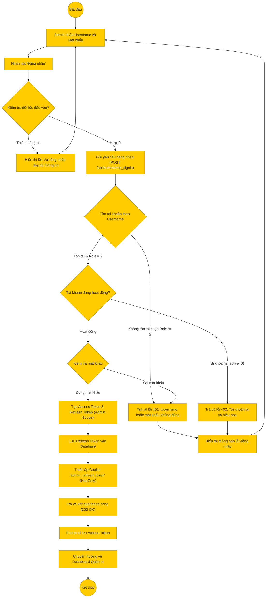

# Sơ đồ hoạt động: Đăng nhập (Quản trị viên)

## Mô tả chi tiết

1.  **Bắt đầu**: Quản trị viên truy cập trang đăng nhập dành riêng cho Admin (Admin Portal).
2.  **Nhập thông tin**: Admin điền Username và Mật khẩu (Lưu ý: Admin dùng Username, User dùng Email).
3.  **Kiểm tra Frontend**: Hệ thống kiểm tra sơ bộ (không để trống).
4.  **Gửi yêu cầu**: Frontend gọi API `POST /api/auth/admin_signin`.
5.  **Xử lý Backend**:
    *   Tìm tài khoản theo `username`.
    *   **Kiểm tra bảo mật**: Nếu không tìm thấy hoặc tài khoản tìm thấy không phải là Admin (`role != 2`), trả về lỗi chung "Username hoặc mật khẩu không đúng" để tránh lộ thông tin tài khoản.
    *   Kiểm tra trạng thái hoạt động (`is_active`).
    *   So khớp mật khẩu (đã mã hóa).
6.  **Thành công**:
    *   Hệ thống tạo cặp Token (Access & Refresh) với scope là `admin`.
    *   Lưu Refresh Token vào DB (cột `admin_refresh_token` hoặc tương đương).
    *   Gửi Refresh Token về Client qua Cookie `admin_refresh_token`.
    *   Trả về Access Token và thông tin Admin.
7.  **Kết thúc**: Frontend lưu Access Token và chuyển hướng vào trang Dashboard.
