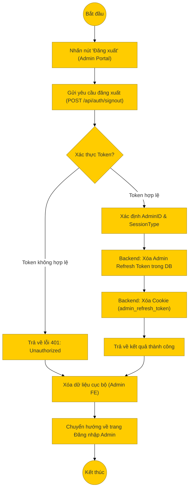

# Sơ đồ hoạt động: Đăng xuất (Quản trị viên)

## Mô tả chi tiết

1.  **Bắt đầu**: Quản trị viên nhấn nút "Đăng xuất" trên giao diện quản trị (Admin Portal).
2.  **Gửi yêu cầu**: Frontend gửi request `POST` đến `/api/auth/signout`.
3.  **Xử lý Backend**:
    *   **Middleware**: Kiểm tra tính hợp lệ của Access Token.
    *   **Controller (`signOut`)**:
        *   Xác định loại phiên làm việc (`sessionType` là 'admin').
        *   Gọi `User.clearAdminRefreshToken(userId)` để xóa token khỏi cơ sở dữ liệu.
        *   Xóa Cookie `admin_refresh_token`.
        *   Trả về phản hồi thành công.
4.  **Xử lý Frontend**:
    *   Xóa các thông tin lưu trữ cục bộ của Admin.
    *   Chuyển hướng về trang đăng nhập dành cho Admin (`/admin/login`).
