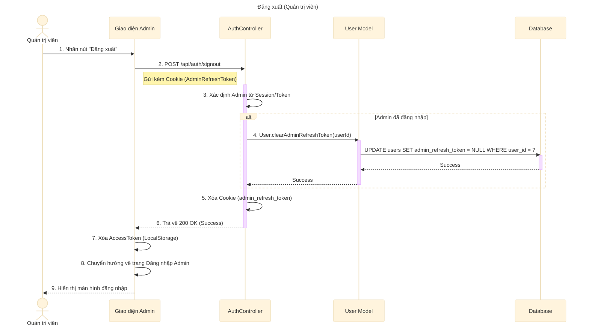

# Sơ đồ tuần tự: Đăng xuất (Quản trị viên)

## Mô tả chi tiết các bước

1.  **Quản trị viên** nhấn nút "Đăng xuất" trên thanh công cụ hoặc menu tài khoản.
2.  **Giao diện Admin** gửi yêu cầu `POST` đến API `/api/auth/signout`.
3.  **AuthController** nhận yêu cầu, xác định phiên làm việc là của Admin (dựa trên `sessionType` hoặc Token).
4.  Nếu xác định được Admin, **AuthController** gọi **User Model** để xóa Refresh Token của Admin trong cơ sở dữ liệu.
    *   Hành động này thu hồi quyền truy cập, ngăn chặn việc sử dụng Refresh Token cũ để lấy Access Token mới.
5.  **User Model** thực hiện câu lệnh `UPDATE` để set `admin_refresh_token` về `NULL`.
6.  **AuthController** xóa Cookie chứa Admin Refresh Token ở phía Client.
7.  **AuthController** trả về phản hồi thành công.
8.  **Giao diện Admin** xóa Access Token đang lưu trong LocalStorage (nếu có).
9.  **Giao diện Admin** chuyển hướng người dùng về trang Đăng nhập dành cho Quản trị viên.
