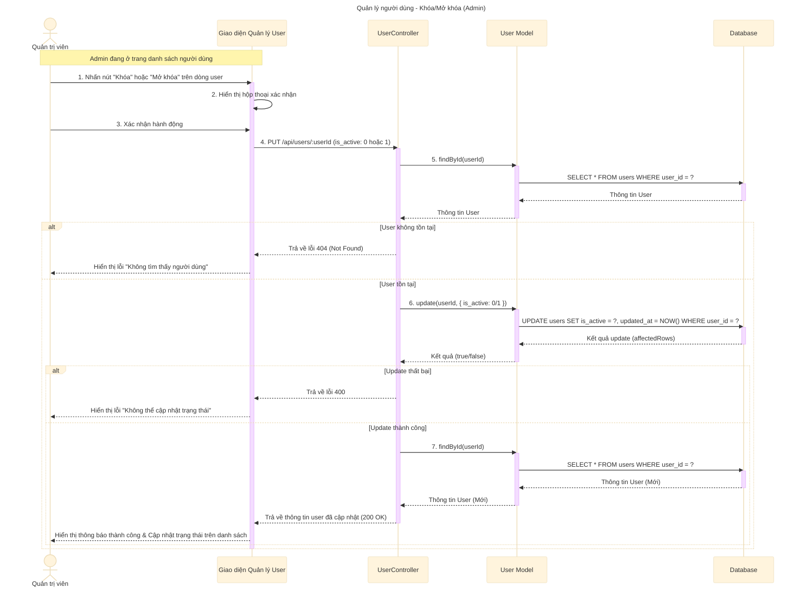

# Sơ đồ tuần tự: Quản lý người dùng - Khóa/Mở khóa (Admin)

Sơ đồ này mô tả quy trình Admin thực hiện khóa (deactivate) hoặc mở khóa (activate) tài khoản người dùng.

```mermaid
%%{init: {'theme': 'base', 'themeVariables': { 'loopBorder': '#000000'}}}%%
sequenceDiagram
    title: Quản lý người dùng - Khóa/Mở khóa (Admin)
    actor Admin as Quản trị viên
    participant UI as Giao diện Quản lý User
    participant Controller as UserController
    participant Model as User Model
    participant DB as Database

    note over Admin, UI: Admin đang ở trang danh sách người dùng

    Admin->>UI: 1. Nhấn nút "Khóa" hoặc "Mở khóa" trên dòng user
    
    activate UI
    UI->>UI: 2. Hiển thị hộp thoại xác nhận
    
    Admin->>UI: 3. Xác nhận hành động
    
    UI->>Controller: 4. PUT /api/users/:userId (is_active: 0 hoặc 1)
    activate Controller
    
    Controller->>Model: 5. findById(userId)
    activate Model
    Model->>DB: SELECT * FROM users WHERE user_id = ?
    activate DB
    DB-->>Model: Thông tin User
    deactivate DB
    Model-->>Controller: Thông tin User
    deactivate Model
    
    alt User không tồn tại
        Controller-->>UI: Trả về lỗi 404 (Not Found)
        UI-->>Admin: Hiển thị lỗi "Không tìm thấy người dùng"
    else User tồn tại
        Controller->>Model: 6. update(userId, { is_active: 0/1 })
        activate Model
        Model->>DB: UPDATE users SET is_active = ?, updated_at = NOW() WHERE user_id = ?
        activate DB
        DB-->>Model: Kết quả update (affectedRows)
        deactivate DB
        Model-->>Controller: Kết quả (true/false)
        deactivate Model
        
        alt Update thất bại
            Controller-->>UI: Trả về lỗi 400
            UI-->>Admin: Hiển thị lỗi "Không thể cập nhật trạng thái"
        else Update thành công
            Controller->>Model: 7. findById(userId)
            activate Model
            Model->>DB: SELECT * FROM users WHERE user_id = ?
            activate DB
            DB-->>Model: Thông tin User (Mới)
            deactivate DB
            Model-->>Controller: Thông tin User (Mới)
            deactivate Model
            
            Controller-->>UI: Trả về thông tin user đã cập nhật (200 OK)
            deactivate Controller
            
            UI-->>Admin: Hiển thị thông báo thành công & Cập nhật trạng thái trên danh sách
        end
    end
    deactivate UI
```