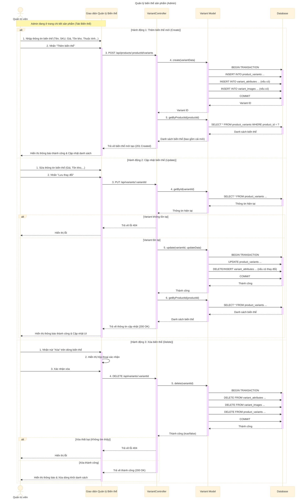

# Sơ đồ tuần tự: Quản lý biến thể sản phẩm (Admin)

Sơ đồ này mô tả quy trình Admin thực hiện các thao tác Thêm, Sửa, Xóa biến thể (Variant) của một sản phẩm.

```mermaid
%%{init: {'theme': 'base', 'themeVariables': { 'loopBorder': '#000000'}}}%%
sequenceDiagram
    title: Quản lý biến thể sản phẩm (Admin)
    actor Admin as Quản trị viên
    participant UI as Giao diện Quản lý Biến thể
    participant Controller as VariantController
    participant Model as Variant Model
    participant DB as Database

    note over Admin, UI: Admin đang ở trang chi tiết sản phẩm (Tab Biến thể)

    alt Hành động 1: Thêm biến thể mới (Create)
        Admin->>UI: 1. Nhập thông tin biến thể (Tên, SKU, Giá, Tồn kho, Thuộc tính...)
        Admin->>UI: 2. Nhấn "Thêm biến thể"
        
        activate UI
        UI->>Controller: 3. POST /api/products/:productId/variants
        activate Controller
        
        Controller->>Model: 4. create(variantData)
        activate Model
        
        Model->>DB: BEGIN TRANSACTION
        activate DB
        Model->>DB: INSERT INTO product_variants ...
        Model->>DB: INSERT INTO variant_attributes ... (nếu có)
        Model->>DB: INSERT INTO variant_images ... (nếu có)
        Model->>DB: COMMIT
        DB-->>Model: Variant ID
        deactivate DB
        
        Model-->>Controller: Variant ID
        deactivate Model
        
        Controller->>Model: 5. getByProductId(productId)
        activate Model
        Model->>DB: SELECT * FROM product_variants WHERE product_id = ?
        activate DB
        DB-->>Model: Danh sách biến thể
        deactivate DB
        Model-->>Controller: Danh sách biến thể (bao gồm cái mới)
        deactivate Model
        
        Controller-->>UI: Trả về biến thể mới tạo (201 Created)
        deactivate Controller
        
        UI-->>Admin: Hiển thị thông báo thành công & Cập nhật danh sách
        deactivate UI

    else Hành động 2: Cập nhật biến thể (Update)
        Admin->>UI: 1. Sửa thông tin biến thể (Giá, Tồn kho,...)
        Admin->>UI: 2. Nhấn "Lưu thay đổi"
        
        activate UI
        UI->>Controller: 3. PUT /api/variants/:variantId
        activate Controller
        
        Controller->>Model: 4. getById(variantId)
        activate Model
        Model->>DB: SELECT * FROM product_variants ...
        activate DB
        DB-->>Model: Thông tin hiện tại
        deactivate DB
        Model-->>Controller: Thông tin hiện tại
        deactivate Model
        
        alt Variant không tồn tại
            Controller-->>UI: Trả về lỗi 404
            UI-->>Admin: Hiển thị lỗi
        else Variant tồn tại
            Controller->>Model: 5. update(variantId, updateData)
            activate Model
            Model->>DB: BEGIN TRANSACTION
            activate DB
            Model->>DB: UPDATE product_variants ...
            Model->>DB: DELETE/INSERT variant_attributes ... (nếu có thay đổi)
            Model->>DB: COMMIT
            DB-->>Model: Thành công
            deactivate DB
            Model-->>Controller: Thành công
            deactivate Model
            
            Controller->>Model: 6. getByProductId(productId)
            activate Model
            Model->>DB: SELECT * FROM product_variants ...
            activate DB
            DB-->>Model: Danh sách biến thể
            deactivate DB
            Model-->>Controller: Danh sách biến thể
            deactivate Model
            
            Controller-->>UI: Trả về thông tin cập nhật (200 OK)
            deactivate Controller
            
            UI-->>Admin: Hiển thị thông báo thành công & Cập nhật UI
        end
        deactivate UI

    else Hành động 3: Xóa biến thể (Delete)
        Admin->>UI: 1. Nhấn nút "Xóa" trên dòng biến thể
        activate UI
        UI->>UI: 2. Hiển thị hộp thoại xác nhận
        Admin->>UI: 3. Xác nhận xóa
        
        UI->>Controller: 4. DELETE /api/variants/:variantId
        activate Controller
        
        Controller->>Model: 5. delete(variantId)
        activate Model
        
        Model->>DB: BEGIN TRANSACTION
        activate DB
        Model->>DB: DELETE FROM variant_attributes ...
        Model->>DB: DELETE FROM variant_images ...
        Model->>DB: DELETE FROM product_variants ...
        Model->>DB: COMMIT
        DB-->>Model: Thành công
        deactivate DB
        
        Model-->>Controller: Thành công (true/false)
        deactivate Model
        
        alt Xóa thất bại (Không tìm thấy)
            Controller-->>UI: Trả về lỗi 404
            UI-->>Admin: Hiển thị lỗi
        else Xóa thành công
            Controller-->>UI: Trả về thành công (200 OK)
            deactivate Controller
            
            UI-->>Admin: Hiển thị thông báo & Xóa dòng khỏi danh sách
        end
        deactivate UI
    end
```