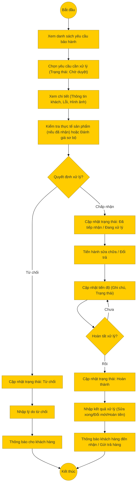

```mermaid
%%{init: {'theme': 'base', 'themeVariables': { 'primaryColor': '#ffcc00', 'edgeLabelBackground':'#ffffff', 'tertiaryColor': '#fff0f0'}}}%%
flowchart TD
    Start((Bắt đầu)) --> ViewList["Xem danh sách yêu cầu bảo hành"]
    ViewList --> SelectRequest["Chọn yêu cầu cần xử lý (Trạng thái: Chờ duyệt)"]
    SelectRequest --> ViewDetail["Xem chi tiết (Thông tin khách, Lỗi, Hình ảnh)"]
    
    ViewDetail --> Verify["Kiểm tra thực tế sản phẩm (nếu đã nhận) hoặc Đánh giá sơ bộ"]
    Verify --> Decision{"Quyết định xử lý?"}
    
    Decision -- "Từ chối" --> Reject["Cập nhật trạng thái: Từ chối"]
    Reject --> InputReason["Nhập lý do từ chối"]
    InputReason --> NotifyUserReject["Thông báo cho khách hàng"]
    
    Decision -- "Chấp nhận" --> Accept["Cập nhật trạng thái: Đã tiếp nhận / Đang xử lý"]
    Accept --> ProcessRepair["Tiến hành sửa chữa / Đổi trả"]
    
    ProcessRepair --> UpdateProgress["Cập nhật tiến độ (Ghi chú, Trạng thái)"]
    UpdateProgress --> FinishRepair{"Hoàn tất xử lý?"}
    
    FinishRepair -- "Chưa" --> UpdateProgress
    FinishRepair -- "Rồi" --> Complete["Cập nhật trạng thái: Hoàn thành"]
    
    Complete --> InputResolution["Nhập kết quả xử lý (Sửa xong/Đổi mới/Hoàn tiền)"]
    InputResolution --> NotifyUserComplete["Thông báo khách hàng đến nhận / Gửi trả hàng"]
    
    NotifyUserReject --> End((Kết thúc))
    NotifyUserComplete --> End
```