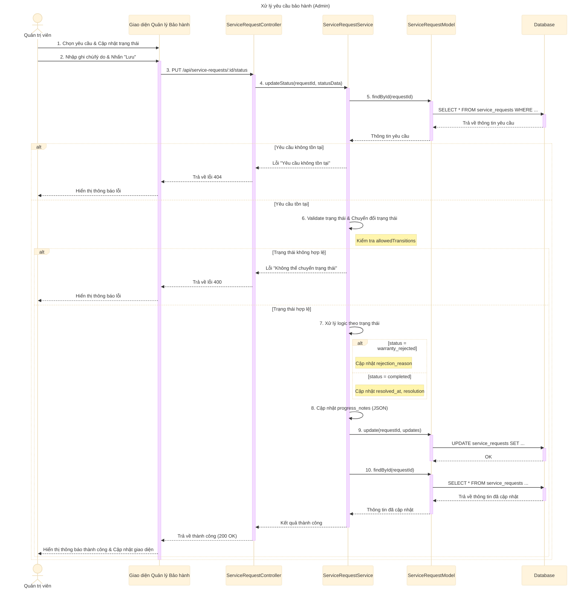

# Sơ đồ tuần tự: Xử lý yêu cầu bảo hành (Admin)

```mermaid
%%{init: {'theme': 'base', 'themeVariables': { 'loopBorder': '#000000'}}}%%
sequenceDiagram
    title: Xử lý yêu cầu bảo hành (Admin)
    actor Admin as Quản trị viên
    participant UI as Giao diện Quản lý Bảo hành
    participant Controller as ServiceRequestController
    participant Service as ServiceRequestService
    participant RequestModel as ServiceRequestModel
    participant DB as Database

    Admin->>UI: 1. Chọn yêu cầu & Cập nhật trạng thái
    Admin->>UI: 2. Nhập ghi chú/lý do & Nhấn "Lưu"
    
    activate UI
    UI->>Controller: 3. PUT /api/service-requests/:id/status
    activate Controller
    
    Controller->>Service: 4. updateStatus(requestId, statusData)
    activate Service
    
    Service->>RequestModel: 5. findById(requestId)
    activate RequestModel
    RequestModel->>DB: SELECT * FROM service_requests WHERE ...
    activate DB
    DB-->>RequestModel: Trả về thông tin yêu cầu
    deactivate DB
    RequestModel-->>Service: Thông tin yêu cầu
    deactivate RequestModel
    
    alt Yêu cầu không tồn tại
        Service-->>Controller: Lỗi "Yêu cầu không tồn tại"
        Controller-->>UI: Trả về lỗi 404
        UI-->>Admin: Hiển thị thông báo lỗi
    else Yêu cầu tồn tại
        Service->>Service: 6. Validate trạng thái & Chuyển đổi trạng thái
        note right of Service: Kiểm tra allowedTransitions
        
        alt Trạng thái không hợp lệ
            Service-->>Controller: Lỗi "Không thể chuyển trạng thái"
            Controller-->>UI: Trả về lỗi 400
            UI-->>Admin: Hiển thị thông báo lỗi
        else Trạng thái hợp lệ
            Service->>Service: 7. Xử lý logic theo trạng thái
            
            alt status = warranty_rejected
                note right of Service: Cập nhật rejection_reason
            else status = completed
                note right of Service: Cập nhật resolved_at, resolution
            end
            
            Service->>Service: 8. Cập nhật progress_notes (JSON)
            
            Service->>RequestModel: 9. update(requestId, updates)
            activate RequestModel
            RequestModel->>DB: UPDATE service_requests SET ...
            activate DB
            DB-->>RequestModel: OK
            deactivate DB
            deactivate RequestModel
            
            Service->>RequestModel: 10. findById(requestId)
            activate RequestModel
            RequestModel->>DB: SELECT * FROM service_requests ...
            activate DB
            DB-->>RequestModel: Trả về thông tin đã cập nhật
            deactivate DB
            RequestModel-->>Service: Thông tin đã cập nhật
            deactivate RequestModel
            
            Service-->>Controller: Kết quả thành công
            deactivate Service
            
            Controller-->>UI: Trả về thành công (200 OK)
            deactivate Controller
            
            UI-->>Admin: Hiển thị thông báo thành công & Cập nhật giao diện
        end
    end
    deactivate UI
```
