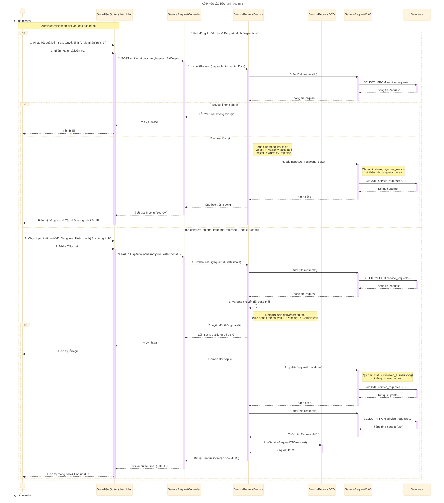

# Sơ đồ tuần tự: Xử lý yêu cầu bảo hành (Admin)

Sơ đồ này mô tả quy trình Admin xử lý một yêu cầu bảo hành, bao gồm hai hành động chính:
1.  **Kiểm tra & Ra quyết định (Inspection)**: Admin kiểm tra sản phẩm và quyết định Chấp nhận hoặc Từ chối bảo hành.
2.  **Cập nhật trạng thái (Update Status)**: Admin cập nhật tiến độ xử lý (VD: Đang sửa, Hoàn thành).

