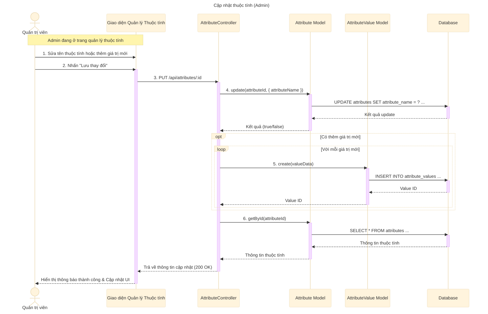

# Sơ đồ tuần tự: Cập nhật thuộc tính (Admin)

```mermaid
%%{init: {'theme': 'base', 'themeVariables': { 'loopBorder': '#000000'}}}%%
sequenceDiagram
    title: Cập nhật thuộc tính (Admin)
    actor Admin as Quản trị viên
    participant UI as Giao diện Quản lý Thuộc tính
    participant Controller as AttributeController
    participant Model as Attribute Model
    participant ValueModel as AttributeValue Model
    participant DB as Database

    note over Admin, UI: Admin đang ở trang quản lý thuộc tính

    Admin->>UI: 1. Sửa tên thuộc tính hoặc thêm giá trị mới
    Admin->>UI: 2. Nhấn "Lưu thay đổi"
    
    activate UI
    UI->>Controller: 3. PUT /api/attributes/:id
    activate Controller
    
    Controller->>Model: 4. update(attributeId, { attributeName })
    activate Model
    Model->>DB: UPDATE attributes SET attribute_name = ? ...
    activate DB
    DB-->>Model: Kết quả update
    deactivate DB
    Model-->>Controller: Kết quả (true/false)
    deactivate Model
    
    opt Có thêm giá trị mới
        loop Với mỗi giá trị mới
            Controller->>ValueModel: 5. create(valueData)
            activate ValueModel
            ValueModel->>DB: INSERT INTO attribute_values ...
            activate DB
            DB-->>ValueModel: Value ID
            deactivate DB
            ValueModel-->>Controller: Value ID
            deactivate ValueModel
        end
    end
    
    Controller->>Model: 6. getById(attributeId)
    activate Model
    Model->>DB: SELECT * FROM attributes ...
    activate DB
    DB-->>Model: Thông tin thuộc tính
    deactivate DB
    Model-->>Controller: Thông tin thuộc tính
    deactivate Model
    
    Controller-->>UI: Trả về thông tin cập nhật (200 OK)
    deactivate Controller
    
    UI-->>Admin: Hiển thị thông báo thành công & Cập nhật UI
    deactivate UI
```