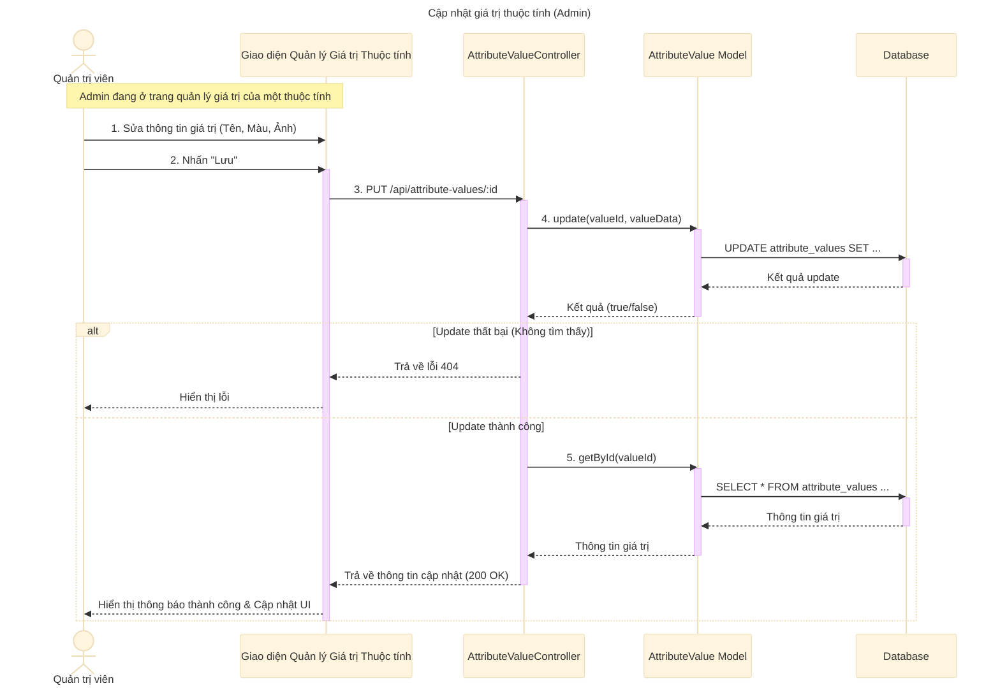

# Sơ đồ tuần tự: Cập nhật giá trị thuộc tính (Admin)

```mermaid
%%{init: {'theme': 'base', 'themeVariables': { 'loopBorder': '#000000'}}}%%
sequenceDiagram
    title: Cập nhật giá trị thuộc tính (Admin)
    actor Admin as Quản trị viên
    participant UI as Giao diện Quản lý Giá trị Thuộc tính
    participant Controller as AttributeValueController
    participant Model as AttributeValue Model
    participant DB as Database

    note over Admin, UI: Admin đang ở trang quản lý giá trị của một thuộc tính

    Admin->>UI: 1. Sửa thông tin giá trị (Tên, Màu, Ảnh)
    Admin->>UI: 2. Nhấn "Lưu"
    
    activate UI
    UI->>Controller: 3. PUT /api/attribute-values/:id
    activate Controller
    
    Controller->>Model: 4. update(valueId, valueData)
    activate Model
    Model->>DB: UPDATE attribute_values SET ...
    activate DB
    DB-->>Model: Kết quả update
    deactivate DB
    Model-->>Controller: Kết quả (true/false)
    deactivate Model
    
    alt Update thất bại (Không tìm thấy)
        Controller-->>UI: Trả về lỗi 404
        UI-->>Admin: Hiển thị lỗi
    else Update thành công
        Controller->>Model: 5. getById(valueId)
        activate Model
        Model->>DB: SELECT * FROM attribute_values ...
        activate DB
        DB-->>Model: Thông tin giá trị
        deactivate DB
        Model-->>Controller: Thông tin giá trị
        deactivate Model
        
        Controller-->>UI: Trả về thông tin cập nhật (200 OK)
        deactivate Controller
        
        UI-->>Admin: Hiển thị thông báo thành công & Cập nhật UI
    end
    deactivate UI
```