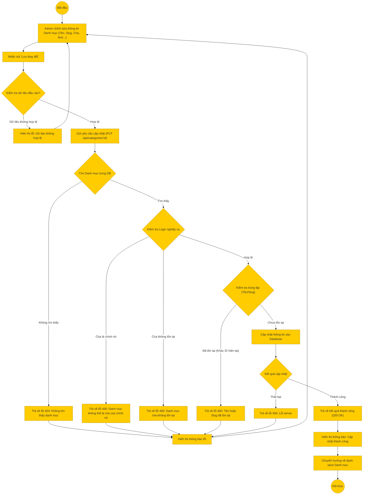

# Sơ đồ hoạt động: Cập nhật danh mục (Quản trị viên)

## Mô tả chi tiết

1.  **Bắt đầu**: Admin chọn một danh mục để chỉnh sửa.
2.  **Nhập thông tin**: Admin thay đổi các thông tin như Tên, Slug, Danh mục cha, Hình ảnh, Trạng thái.
3.  **Kiểm tra Frontend**: Kiểm tra tính hợp lệ cơ bản.
4.  **Gửi yêu cầu**: Frontend gọi API `PUT /api/categories/:id`.
5.  **Xử lý Backend**:
    *   **Kiểm tra tồn tại**: Nếu ID không tồn tại -> 404.
    *   **Kiểm tra Logic**:
        *   Không cho phép đặt danh mục cha là chính nó (Circular reference).
        *   Kiểm tra danh mục cha có tồn tại không (nếu có set parent).
    *   **Kiểm tra trùng lặp**: Nếu đổi tên/slug, kiểm tra xem có trùng với danh mục khác không.
    *   **Cập nhật**: Lưu thay đổi vào DB.
6.  **Thành công**: Trả về thông tin danh mục mới.
7.  **Kết thúc**: Frontend hiển thị thông báo và quay lại danh sách.
