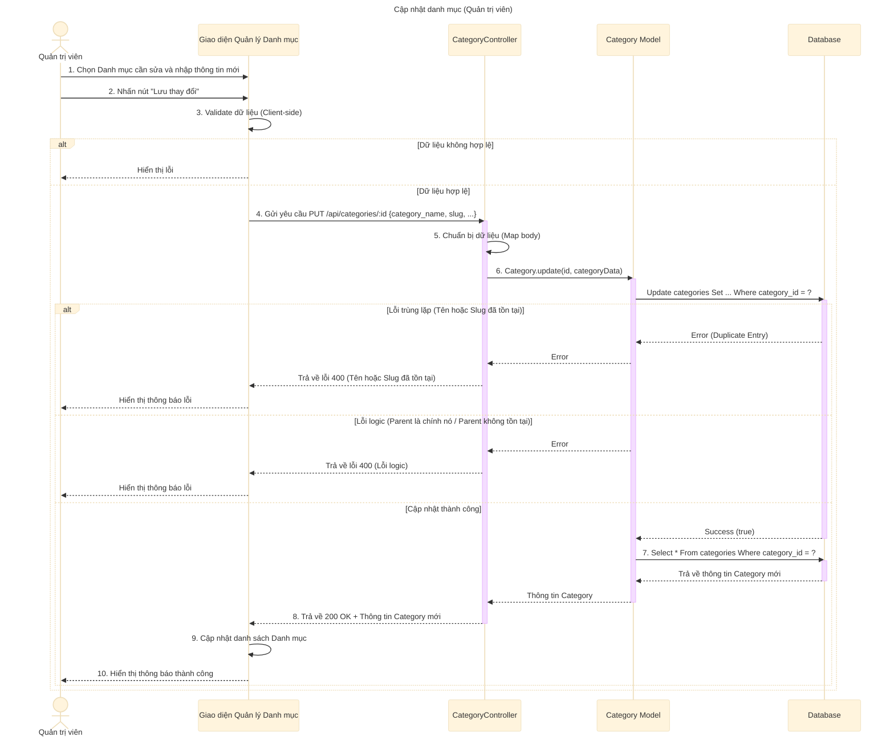

# Sơ đồ tuần tự: Cập nhật danh mục (Quản trị viên)

## Mô tả chi tiết các bước

1.  **Quản trị viên** chọn một danh mục cần chỉnh sửa và nhập các thông tin mới (Tên, Slug, Mô tả, Danh mục cha...).
2.  **Giao diện** kiểm tra sơ bộ (validate) dữ liệu.
3.  Nếu dữ liệu hợp lệ, **Giao diện** gửi request `PUT` đến API `updateCategory`.
4.  **CategoryController** nhận request và ánh xạ dữ liệu.
5.  **CategoryController** gọi **Category Model** để cập nhật thông tin vào Database.
6.  **Category Model** thực hiện câu lệnh `UPDATE`.
    *   Nếu xảy ra lỗi trùng lặp (Duplicate Entry), trả về lỗi 400.
    *   Nếu xảy ra lỗi logic (ví dụ: chọn danh mục cha là chính nó), trả về lỗi 400.
    *   Nếu không tìm thấy danh mục, trả về lỗi 404.
7.  Nếu cập nhật thành công, **Category Model** truy vấn lại Database để lấy thông tin mới nhất của danh mục.
8.  **CategoryController** trả về phản hồi thành công (200 OK) kèm thông tin danh mục đã cập nhật.
9.  **Giao diện** cập nhật danh sách và hiển thị thông báo thành công.
