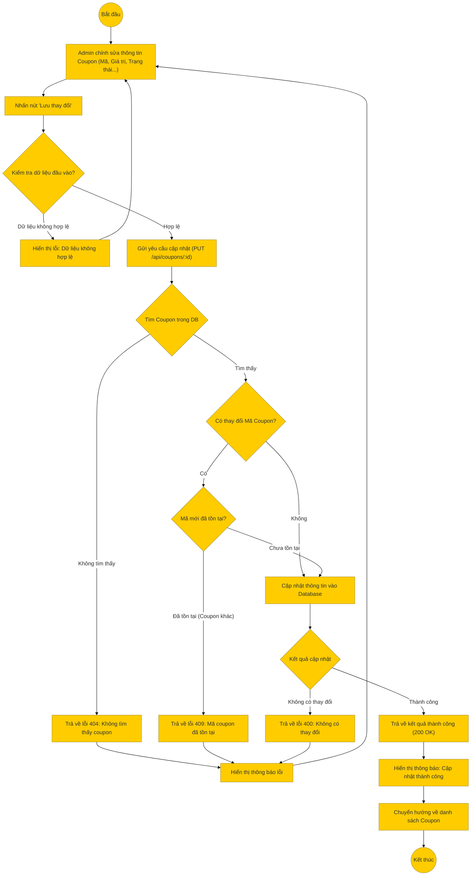

# Sơ đồ hoạt động: Cập nhật mã giảm giá (Quản trị viên)

## Mô tả chi tiết

1.  **Bắt đầu**: Admin chọn một mã giảm giá từ danh sách để chỉnh sửa.
2.  **Nhập thông tin**: Admin thay đổi các thông tin cần thiết (Mã, Giá trị, Trạng thái hoạt động...).
3.  **Kiểm tra Frontend**: Kiểm tra tính hợp lệ của dữ liệu nhập vào.
4.  **Gửi yêu cầu**: Frontend gọi API `PUT /api/coupons/:couponId`.
5.  **Xử lý Backend**:
    *   **Kiểm tra tồn tại**: Tìm coupon theo ID. Nếu không thấy, trả về 404.
    *   **Kiểm tra mã trùng**: Nếu Admin đổi mã coupon (`coupon_code`), hệ thống kiểm tra xem mã mới này đã được dùng bởi coupon khác chưa. Nếu trùng, trả về 409.
    *   **Cập nhật**: Thực hiện cập nhật dữ liệu vào DB.
6.  **Thành công**: Trả về thông tin coupon sau khi cập nhật.
7.  **Kết thúc**: Frontend hiển thị thông báo và quay lại danh sách.
