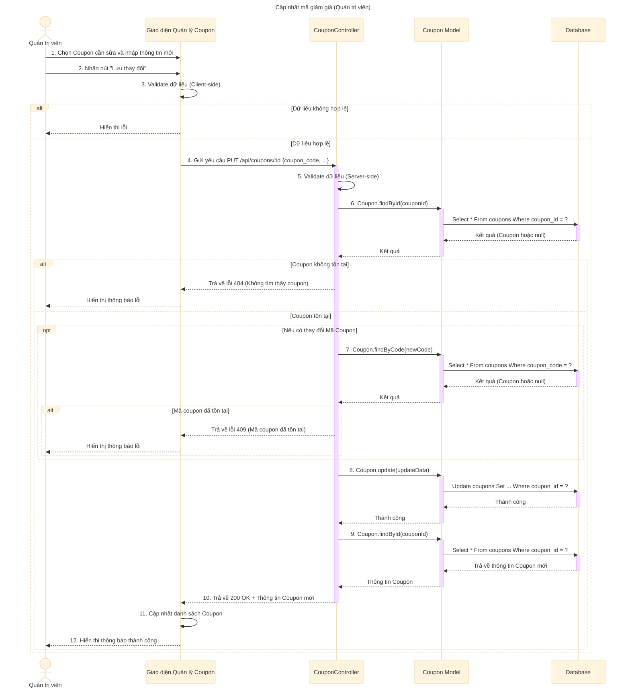

# Sơ đồ tuần tự: Cập nhật mã giảm giá (Quản trị viên)

## Mô tả chi tiết các bước

1.  **Quản trị viên** chọn một mã giảm giá cần chỉnh sửa và nhập các thông tin mới (Mã, Loại, Giá trị...).
2.  **Giao diện** kiểm tra sơ bộ (validate) dữ liệu.
3.  Nếu dữ liệu hợp lệ, **Giao diện** gửi request `PUT` đến API `updateCoupon`.
4.  **CouponController** nhận request và kiểm tra dữ liệu đầu vào.
5.  **CouponController** gọi **Coupon Model** để tìm coupon theo ID.
6.  Nếu không tìm thấy coupon, trả về lỗi 404.
7.  Nếu tìm thấy coupon:
    *   Nếu người dùng thay đổi `coupon_code`, kiểm tra xem mã mới đã tồn tại chưa.
    *   Nếu mã mới đã tồn tại, trả về lỗi 409.
8.  Nếu dữ liệu hợp lệ, gọi **Coupon Model** để cập nhật thông tin vào Database.
9.  Sau khi cập nhật thành công, gọi **Coupon Model** để lấy lại thông tin mới nhất của coupon.
10. **CouponController** trả về phản hồi thành công (200 OK) kèm thông tin coupon đã cập nhật.
11. **Giao diện** cập nhật danh sách và hiển thị thông báo thành công.
