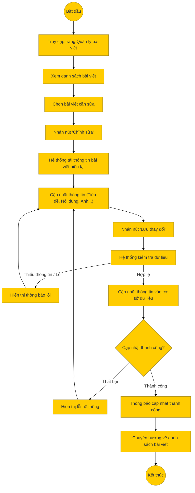

```mermaid
%%{init: {'theme': 'base', 'themeVariables': { 'primaryColor': '#ffcc00', 'edgeLabelBackground':'#ffffff', 'tertiaryColor': '#fff0f0'}}}%%
flowchart TD
    Start((Bắt đầu)) --> AccessPage["Truy cập trang Quản lý bài viết"]
    AccessPage --> ViewList["Xem danh sách bài viết"]
    ViewList --> SelectPost["Chọn bài viết cần sửa"]
    SelectPost --> ClickEdit["Nhấn nút 'Chỉnh sửa'"]
    
    ClickEdit --> LoadData["Hệ thống tải thông tin bài viết hiện tại"]
    LoadData --> EditForm["Cập nhật thông tin (Tiêu đề, Nội dung, Ảnh...)"]
    
    EditForm --> ClickSave["Nhấn nút 'Lưu thay đổi'"]
    ClickSave --> Validate["Hệ thống kiểm tra dữ liệu"]
    
    Validate -- "Thiếu thông tin / Lỗi" --> ShowError["Hiển thị thông báo lỗi"]
    ShowError --> EditForm
    
    Validate -- "Hợp lệ" --> UpdateDB["Cập nhật thông tin vào cơ sở dữ liệu"]
    UpdateDB --> CheckResult{"Cập nhật thành công?"}
    
    CheckResult -- "Thất bại" --> ShowDBError["Hiển thị lỗi hệ thống"]
    ShowDBError --> EditForm
    
    CheckResult -- "Thành công" --> NotifySuccess["Thông báo cập nhật thành công"]
    NotifySuccess --> Redirect["Chuyển hướng về danh sách bài viết"]
    Redirect --> End((Kết thúc))
```