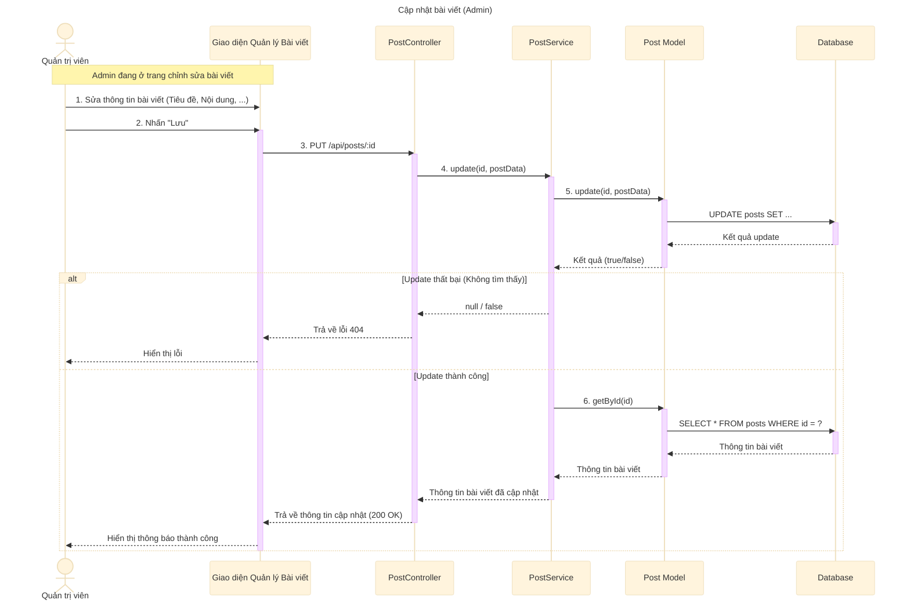

# Sơ đồ tuần tự: Cập nhật bài viết (Admin)

```mermaid
%%{init: {'theme': 'base', 'themeVariables': { 'loopBorder': '#000000'}}}%%
sequenceDiagram
    title: Cập nhật bài viết (Admin)
    actor Admin as Quản trị viên
    participant UI as Giao diện Quản lý Bài viết
    participant Controller as PostController
    participant Service as PostService
    participant Model as Post Model
    participant DB as Database

    note over Admin, UI: Admin đang ở trang chỉnh sửa bài viết

    Admin->>UI: 1. Sửa thông tin bài viết (Tiêu đề, Nội dung, ...)
    Admin->>UI: 2. Nhấn "Lưu"
    
    activate UI
    UI->>Controller: 3. PUT /api/posts/:id
    activate Controller
    
    Controller->>Service: 4. update(id, postData)
    activate Service
    Service->>Model: 5. update(id, postData)
    activate Model
    Model->>DB: UPDATE posts SET ...
    activate DB
    DB-->>Model: Kết quả update
    deactivate DB
    Model-->>Service: Kết quả (true/false)
    deactivate Model
    
    alt Update thất bại (Không tìm thấy)
        Service-->>Controller: null / false
        Controller-->>UI: Trả về lỗi 404
        UI-->>Admin: Hiển thị lỗi
    else Update thành công
        Service->>Model: 6. getById(id)
        activate Model
        Model->>DB: SELECT * FROM posts WHERE id = ?
        activate DB
        DB-->>Model: Thông tin bài viết
        deactivate DB
        Model-->>Service: Thông tin bài viết
        deactivate Model
        
        Service-->>Controller: Thông tin bài viết đã cập nhật
        deactivate Service
        
        Controller-->>UI: Trả về thông tin cập nhật (200 OK)
        deactivate Controller
        
        UI-->>Admin: Hiển thị thông báo thành công
    end
    deactivate UI
```