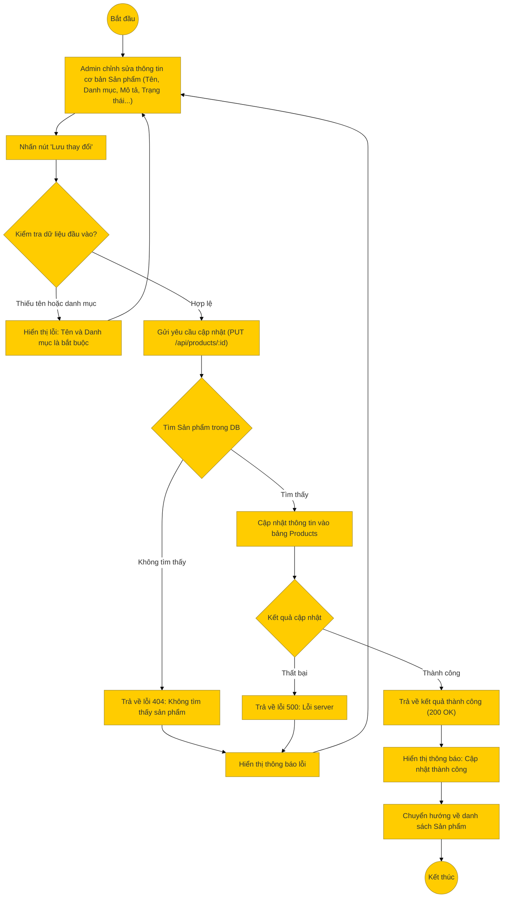

# Sơ đồ hoạt động: Cập nhật sản phẩm (Quản trị viên)

## Mô tả chi tiết

1.  **Bắt đầu**: Admin chọn một sản phẩm để chỉnh sửa thông tin chung.
2.  **Nhập thông tin**: Admin thay đổi các trường như Tên sản phẩm, Danh mục, Mô tả, Trạng thái (Ẩn/Hiện), Nổi bật.
    *   *Lưu ý*: Việc cập nhật giá, tồn kho hoặc các biến thể (Variants) được thực hiện qua các chức năng quản lý biến thể riêng biệt.
3.  **Kiểm tra Frontend**: Kiểm tra các trường bắt buộc (Tên, Danh mục).
4.  **Gửi yêu cầu**: Frontend gọi API `PUT /api/products/:id`.
5.  **Xử lý Backend**:
    *   **Kiểm tra tồn tại**: Nếu ID không tồn tại -> 404.
    *   **Cập nhật**: Thực hiện câu lệnh `UPDATE products` trong Database.
6.  **Thành công**: Trả về thông tin sản phẩm sau khi cập nhật.
7.  **Kết thúc**: Frontend hiển thị thông báo và cập nhật lại giao diện.
