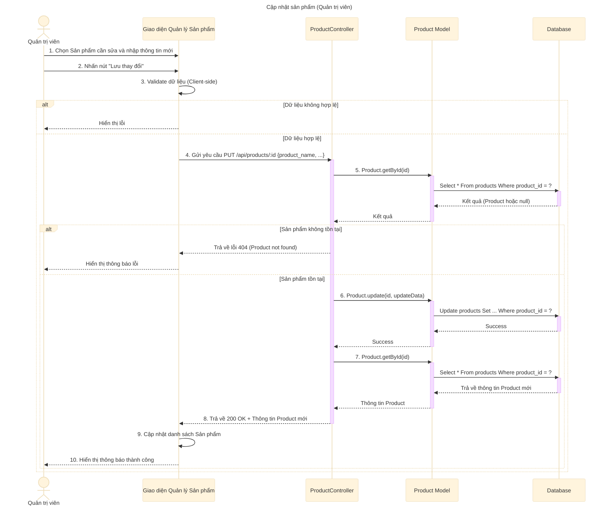

# Sơ đồ tuần tự: Cập nhật sản phẩm (Quản trị viên)

## Mô tả chi tiết các bước

1.  **Quản trị viên** chọn một sản phẩm cần chỉnh sửa và nhập các thông tin mới (Tên, Danh mục, Mô tả, Giá...).
2.  **Giao diện** kiểm tra sơ bộ (validate) dữ liệu.
3.  Nếu dữ liệu hợp lệ, **Giao diện** gửi request `PUT` đến API `updateProduct`.
4.  **ProductController** nhận request và kiểm tra xem sản phẩm có tồn tại không.
5.  Nếu không tìm thấy sản phẩm, trả về lỗi 404.
6.  Nếu tìm thấy, **ProductController** gọi **Product Model** để cập nhật thông tin vào Database.
7.  **Product Model** thực hiện câu lệnh `UPDATE`.
8.  Sau khi cập nhật thành công, **ProductController** gọi **Product Model** để lấy lại thông tin mới nhất của sản phẩm.
9.  **ProductController** trả về phản hồi thành công (200 OK) kèm thông tin sản phẩm đã cập nhật.
10. **Giao diện** cập nhật danh sách và hiển thị thông báo thành công.
