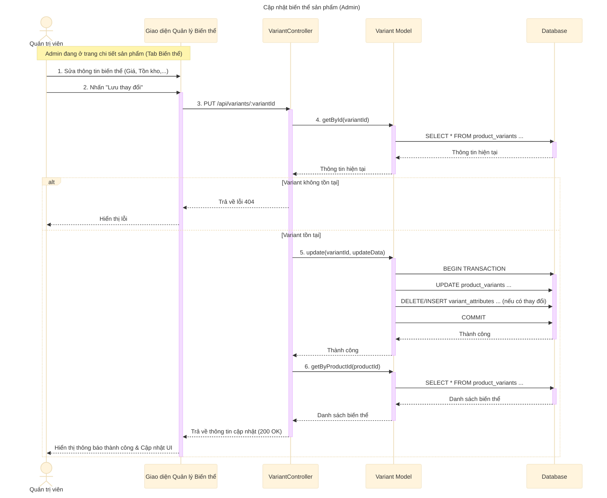

# Sơ đồ tuần tự: Cập nhật biến thể sản phẩm (Admin)

```mermaid
%%{init: {'theme': 'base', 'themeVariables': { 'loopBorder': '#000000'}}}%%
sequenceDiagram
    title: Cập nhật biến thể sản phẩm (Admin)
    actor Admin as Quản trị viên
    participant UI as Giao diện Quản lý Biến thể
    participant Controller as VariantController
    participant Model as Variant Model
    participant DB as Database

    note over Admin, UI: Admin đang ở trang chi tiết sản phẩm (Tab Biến thể)

    Admin->>UI: 1. Sửa thông tin biến thể (Giá, Tồn kho,...)
    Admin->>UI: 2. Nhấn "Lưu thay đổi"
    
    activate UI
    UI->>Controller: 3. PUT /api/variants/:variantId
    activate Controller
    
    Controller->>Model: 4. getById(variantId)
    activate Model
    Model->>DB: SELECT * FROM product_variants ...
    activate DB
    DB-->>Model: Thông tin hiện tại
    deactivate DB
    Model-->>Controller: Thông tin hiện tại
    deactivate Model
    
    alt Variant không tồn tại
        Controller-->>UI: Trả về lỗi 404
        UI-->>Admin: Hiển thị lỗi
    else Variant tồn tại
        Controller->>Model: 5. update(variantId, updateData)
        activate Model
        Model->>DB: BEGIN TRANSACTION
        activate DB
        Model->>DB: UPDATE product_variants ...
        Model->>DB: DELETE/INSERT variant_attributes ... (nếu có thay đổi)
        Model->>DB: COMMIT
        DB-->>Model: Thành công
        deactivate DB
        Model-->>Controller: Thành công
        deactivate Model
        
        Controller->>Model: 6. getByProductId(productId)
        activate Model
        Model->>DB: SELECT * FROM product_variants ...
        activate DB
        DB-->>Model: Danh sách biến thể
        deactivate DB
        Model-->>Controller: Danh sách biến thể
        deactivate Model
        
        Controller-->>UI: Trả về thông tin cập nhật (200 OK)
        deactivate Controller
        
        UI-->>Admin: Hiển thị thông báo thành công & Cập nhật UI
    end
    deactivate UI
```