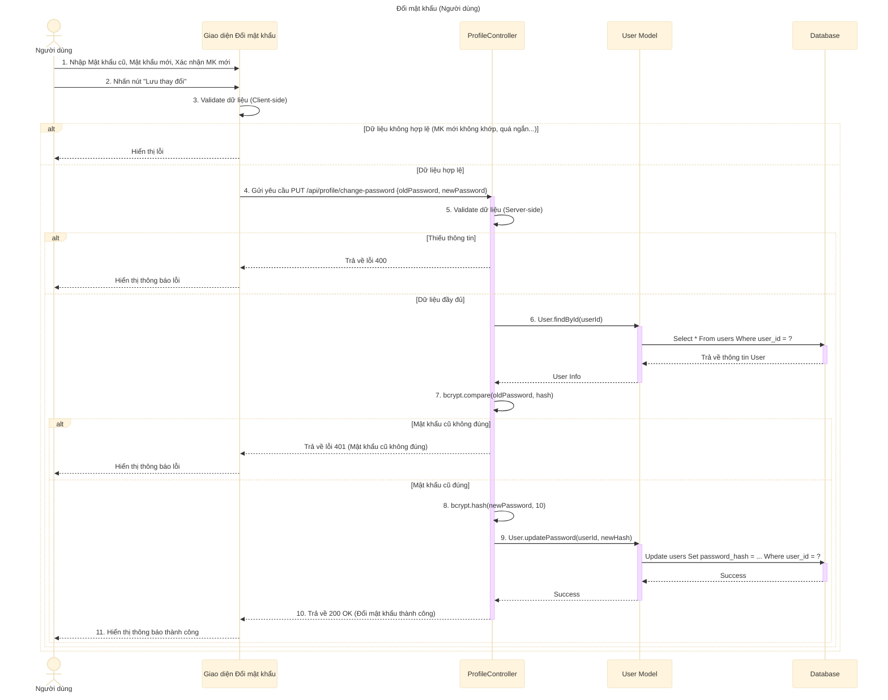

# Sơ đồ tuần tự: Đổi mật khẩu (Người dùng)

## Mô tả chi tiết các bước

1.  **Người dùng** (đã đăng nhập) truy cập trang đổi mật khẩu, nhập Mật khẩu cũ, Mật khẩu mới và Xác nhận mật khẩu mới.
2.  **Giao diện** kiểm tra sơ bộ (validate) dữ liệu:
    *   Mật khẩu mới và Xác nhận mật khẩu phải khớp nhau.
    *   Độ dài mật khẩu mới phải đảm bảo yêu cầu (ví dụ: >= 6 ký tự).
3.  Nếu dữ liệu hợp lệ, **Giao diện** gửi request `PUT` đến API `changePassword` (ví dụ: `/api/profile/change-password`).
4.  **ProfileController** nhận request và kiểm tra dữ liệu đầu vào.
5.  **ProfileController** lấy thông tin user hiện tại từ Database thông qua **User Model** (dựa trên `userId` từ session/token).
6.  **ProfileController** so sánh `oldPassword` người dùng nhập vào với `password_hash` trong Database bằng `bcrypt`.
7.  Nếu mật khẩu cũ không đúng, trả về lỗi 401.
8.  Nếu mật khẩu cũ đúng:
    *   Mã hóa `newPassword` bằng `bcrypt`.
    *   Gọi **User Model** để cập nhật mật khẩu mới vào Database.
9.  **ProfileController** trả về phản hồi thành công (200 OK).
10. **Giao diện** hiển thị thông báo "Đổi mật khẩu thành công" cho người dùng.
