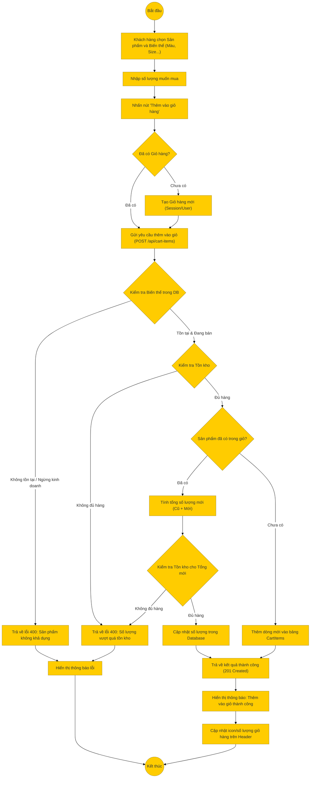

# Sơ đồ hoạt động: Thêm sản phẩm vào giỏ hàng (Khách hàng)

## Mô tả chi tiết

1.  **Bắt đầu**: Khách hàng đang xem chi tiết sản phẩm.
2.  **Chọn biến thể**: Khách hàng chọn các thuộc tính (nếu có) và số lượng.
3.  **Gửi yêu cầu**:
    *   Frontend kiểm tra xem đã có `cartId` (trong LocalStorage hoặc User Session) chưa. Nếu chưa, gọi API tạo giỏ hàng trước.
    *   Sau đó gọi API `POST /api/cart-items` với `cartId`, `variantId`, `quantity`.
4.  **Xử lý Backend**:
    *   **Kiểm tra sản phẩm**: Xác thực biến thể tồn tại và đang hoạt động (`is_active`).
    *   **Kiểm tra tồn kho**: So sánh số lượng yêu cầu với `stock_quantity`.
    *   **Xử lý trùng lặp**:
        *   Nếu sản phẩm đã có trong giỏ: Cộng dồn số lượng. Kiểm tra lại tồn kho với tổng số lượng mới.
        *   Nếu chưa có: Tạo dòng mới.
5.  **Thành công**: Trả về kết quả.
6.  **Kết thúc**: Frontend hiển thị thông báo và cập nhật số lượng trên icon giỏ hàng.
