# Sơ đồ hoạt động: Xây dựng cấu hình PC (Khách hàng)

```mermaid
%%{init: {'theme': 'base', 'themeVariables': { 'primaryColor': '#ffcc00', 'edgeLabelBackground':'#ffffff', 'tertiaryColor': '#fff0f0'}}}%%
flowchart TD
    Start((Bắt đầu)) --> AccessBuildPage["Truy cập trang 'Xây dựng cấu hình PC'"]
    
    AccessBuildPage --> DisplaySlots["Hiển thị danh sách linh kiện (CPU, Main, RAM, VGA...)"]
    
    DisplaySlots --> SelectSlot["Chọn một linh kiện (Ví dụ: CPU)"]
    
    SelectSlot --> CallAPI["Gửi yêu cầu lấy sản phẩm (GET /api/products/build-pc?category_id=...)"]
    
    CallAPI --> BackendProcess["Backend: Xử lý yêu cầu"]
    
    BackendProcess --> QueryProducts["Truy vấn sản phẩm theo Category"]
    QueryProducts --> QueryVariants["Truy vấn biến thể & giá của từng sản phẩm"]
    QueryVariants --> ReturnList["Trả về danh sách sản phẩm & biến thể"]
    
    ReturnList --> DisplayProducts["Hiển thị danh sách sản phẩm để chọn"]
    
    DisplayProducts --> UserSelect["Người dùng chọn sản phẩm"]
    
    UserSelect --> AddToConfig["Thêm vào cấu hình tạm tính"]
    AddToConfig --> UpdateTotal["Cập nhật tổng tiền dự kiến"]
    
    UpdateTotal --> CheckMore{Chọn tiếp linh kiện khác?}
    
    CheckMore -- "Có" --> SelectSlot
    
    CheckMore -- "Không (Hoàn tất)" --> ReviewConfig["Xem lại cấu hình đã chọn"]
    
    ReviewConfig --> ClickAddToCart["Nhấn nút 'Thêm vào giỏ hàng'"]
    
    ClickAddToCart --> LoopItems["Frontend: Duyệt qua từng linh kiện trong cấu hình"]
    
    LoopItems --> CallAddCart["Gửi yêu cầu thêm vào giỏ (POST /api/cart/items)"]
    
    CallAddCart --> CheckDone{Còn linh kiện cần thêm?}
    
    CheckDone -- "Còn" --> LoopItems
    CheckDone -- "Hết" --> ShowSuccess["Thông báo: Đã thêm toàn bộ cấu hình vào giỏ"]
    
    ShowSuccess --> End((Kết thúc))
```

## Mô tả chi tiết

1.  **Truy cập**: Khách hàng vào trang "Build PC". Giao diện hiển thị các slot linh kiện cần thiết (Vi xử lý, Bo mạch chủ, RAM, Ổ cứng, Card màn hình, Nguồn, Vỏ máy...).
2.  **Chọn linh kiện**:
    *   Người dùng nhấn vào nút "Chọn" ở một slot (ví dụ: CPU).
    *   Frontend gọi API `GET /api/products/build-pc` với `category_id` tương ứng.
3.  **Xử lý Backend**:
    *   Hệ thống truy vấn danh sách sản phẩm thuộc danh mục đó.
    *   Kèm theo thông tin biến thể (Variant) để lấy giá và tồn kho chính xác.
    *   Trả về dữ liệu cho Frontend hiển thị.
4.  **Xây dựng cấu hình**:
    *   Người dùng chọn sản phẩm mong muốn.
    *   Sản phẩm được thêm vào danh sách cấu hình tạm thời trên trình duyệt.
    *   Hệ thống tự động tính tổng tiền dự kiến.
5.  **Hoàn tất & Thêm vào giỏ**:
    *   Sau khi chọn đủ linh kiện, người dùng nhấn "Thêm vào giỏ hàng".
    *   Frontend sẽ thực hiện vòng lặp, gọi API thêm vào giỏ hàng (`addToCart`) cho từng linh kiện đã chọn.
    *   Hiển thị thông báo thành công khi hoàn tất.
