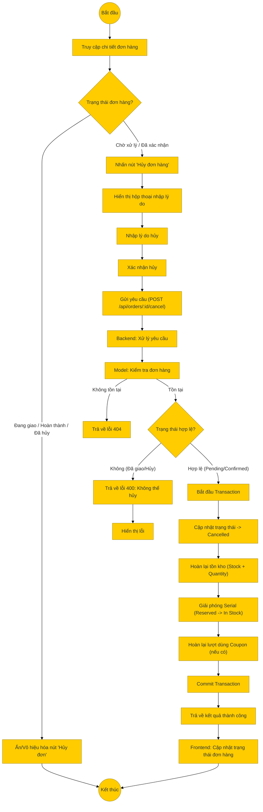

# Sơ đồ hoạt động: Hủy đơn hàng (Khách hàng)

## Mô tả chi tiết

1.  **Điều kiện**: Khách hàng chỉ có thể hủy đơn hàng khi trạng thái là **Chờ xử lý (Pending)** hoặc **Đã xác nhận (Confirmed)**. Nếu đơn hàng đã giao cho vận chuyển, nút hủy sẽ bị ẩn hoặc vô hiệu hóa.
2.  **Thao tác**: Người dùng nhấn nút hủy và bắt buộc phải nhập lý do.
3.  **Gửi yêu cầu**: Frontend gửi request `POST` đến `/api/orders/:id/cancel` kèm theo `reason`.
4.  **Xử lý Backend**:
    *   **Kiểm tra**: Xác minh trạng thái đơn hàng hiện tại.
    *   **Transaction**: Thực hiện chuỗi hành động trong một giao dịch DB:
        *   Cập nhật trạng thái đơn hàng thành `cancelled`.
        *   Cộng lại số lượng sản phẩm vào kho (`stock_quantity`).
        *   Giải phóng các mã Serial đã giữ chỗ (nếu có).
        *   Hoàn lại lượt sử dụng mã giảm giá (nếu có).
5.  **Kết quả**: Trả về thông báo thành công và cập nhật giao diện.
