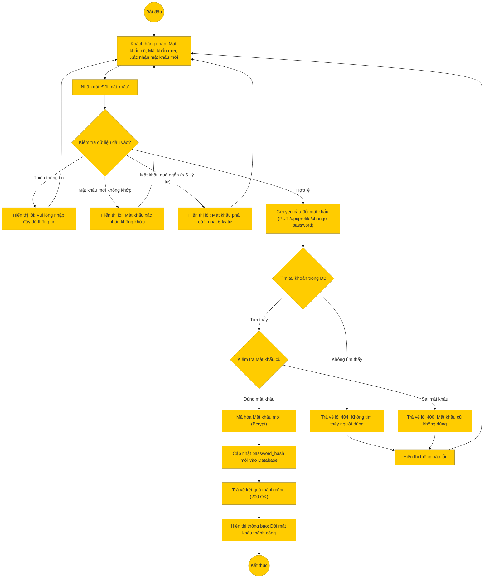

# Sơ đồ hoạt động: Đổi mật khẩu (Khách hàng)

## Mô tả chi tiết

1.  **Bắt đầu**: Người dùng truy cập trang quản lý tài khoản, mục Đổi mật khẩu.
2.  **Nhập thông tin**: Người dùng nhập 3 trường: Mật khẩu hiện tại, Mật khẩu mới và Nhập lại mật khẩu mới.
3.  **Kiểm tra Frontend**:
    *   Đảm bảo không bỏ trống trường nào.
    *   So sánh Mật khẩu mới và Xác nhận mật khẩu phải trùng khớp.
    *   Kiểm tra độ dài tối thiểu (ví dụ: 6 ký tự).
4.  **Gửi yêu cầu**: Frontend gọi API (dự kiến: `PUT /api/profile/change-password`).
5.  **Xử lý Backend**:
    *   Lấy thông tin user từ Token xác thực.
    *   **Xác thực mật khẩu cũ**: Dùng `bcrypt.compare` để so sánh mật khẩu cũ người dùng nhập với hash trong DB. Nếu sai, từ chối yêu cầu.
    *   **Mã hóa mật khẩu mới**: Nếu mật khẩu cũ đúng, tiến hành hash mật khẩu mới.
    *   **Cập nhật**: Lưu hash mới vào Database.
6.  **Thành công**: Trả về thông báo thành công cho người dùng.
