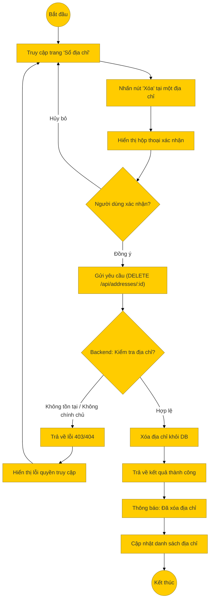

# Sơ đồ hoạt động: Xóa địa chỉ (Khách hàng)

## Mô tả chi tiết

1.  **Truy cập**: Khách hàng vào sổ địa chỉ.
2.  **Thao tác**: Nhấn nút "Xóa" tại một địa chỉ cụ thể.
3.  **Xác nhận**: Hệ thống hiển thị hộp thoại xác nhận (Confirm Dialog) để tránh xóa nhầm.
4.  **Gửi yêu cầu**: Nếu người dùng đồng ý, Frontend gửi API `DELETE /api/addresses/:id`.
5.  **Xử lý Backend**:
    *   **Kiểm tra quyền**: Xác minh địa chỉ (`id`) có tồn tại và thuộc về người dùng đang đăng nhập (`user_id`) hay không.
    *   **Xóa**: Thực hiện lệnh `DELETE` trong cơ sở dữ liệu.
6.  **Kết thúc**: Hiển thị thông báo thành công và xóa địa chỉ đó khỏi danh sách hiển thị.
